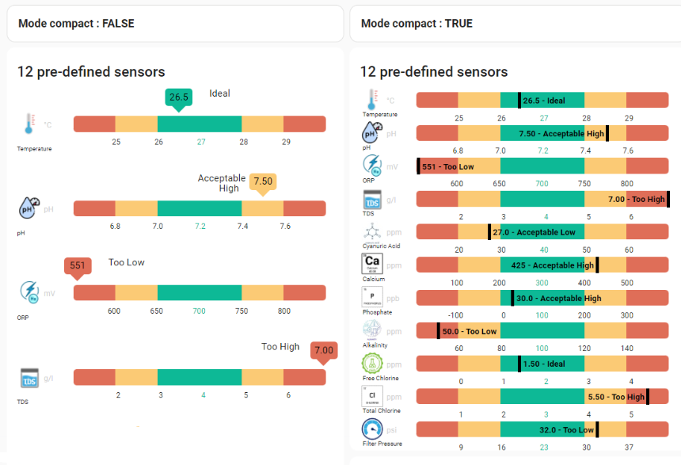
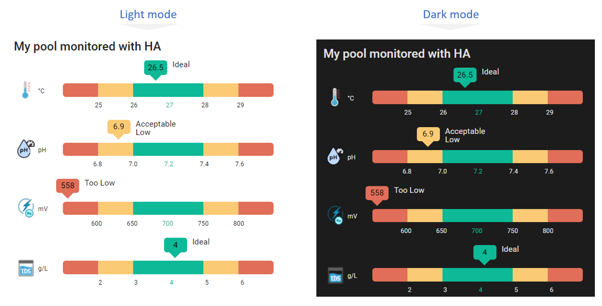

# Pool Monitor Card

[](https://github.com/hacs/integration)

## ReadMe multilingue

Clique sur les boutons suivants pour choisir la langue de ton ReadMe : [](https://github.com/wilsto/pool-monitor-card/blob/master/README-fr.md) [](https://github.com/wilsto/pool-monitor-card/blob/master/README.md)

## Description

La "Pool Monitor Card" est un plugin d'Home Assistant qui fournit des informations sur la température, le pH, les niveaux d'ORP et de TDS de votre piscine.

- **Température** : Il s'agit de la température de l'eau de votre piscine. La température idéale d'une piscine se situe entre 26°C et 28°C.  Connaître la température peut vous aider à décider si l'eau est suffisamment chaude pour nager ou si elle est trop froide et doit être chauffée.

- **pH** : Il s'agit d'une mesure de l'acidité ou de l'alcalinité de l'eau de votre piscine. Le pH idéal d'une piscine se situe entre 7,0 et 7,4. Le maintien d'un niveau de pH approprié permet d'éviter les irritations de la peau et des yeux et de garder l'eau de la piscine propre à la baignade.

- **ORP** : Il s'agit du potentiel d'oxydo-réduction, qui mesure la capacité de l'eau à oxyder ou à réduire les substances présentes dans la piscine. Le niveau de ORP est lié à la quantité de chlore ou d'autres désinfectants dans la piscine.  La plage idéale pour le chlore dans une piscine se situe entre 650 et 750 mV. Le maintien d'un niveau ORP correct permet de s'assurer que l'eau de la piscine est correctement assainie et exempte de bactéries nocives.

- **TDS**: Il s'agit du total des solides dissous, qui mesure la quantité de substances inorganiques et organiques présentes dans l'eau, telles que les minéraux, les sels et d'autres particules. Des niveaux élevés de TDS peuvent affecter la clarté de l'eau et rendre difficile l'équilibre des produits chimiques dans la piscine. La plage idéale pour le TDS dans une piscine d'eau salée se situe entre 3 000 et 5 000 parties par million (ppm) (3 et 5 g/L).

Avec la "Pool Monitor Card", vous pouvez facilement contrôler ces aspects importants de votre piscine et faire les ajustements nécessaires pour que l'eau soit sûre et agréable à la baignade.



## Support

Hey mec ! Aide-moi pour quelques :beers: ou un :coffee:!

[](https://bmc.link/wilsto)

## Installation

### via HACS

La carte Home Assistant Pool Monitor est disponible par défaut dans le répertoire HACS. Plus d'infos  [ici](https://hacs.xyz/).

ou cliquez sur :
[](https://my.home-assistant.io/redirect/hacs_repository/?owner=wilsto&repository=pool-monitor-card&category=plugin)

### Manuellement

1. Téléchargez le fichier `pool_monitor_card.js` depuis la [dernière version disponible](https://github.com/wilsto/pool-monitor-card/releases) et sauvegardez-le dans votre dossier `configuration/www`.
1. Allez dans `Configuration > Lovelace dashboard > Resources` dans Home Assistant et cliquez sur `Add resource`.
    1. Ajoutez `/local/community/pool-monitor-card/pool_monitor_card.js` à l'URL.
    1. Choisissez `Javascript Module` comme Resource type.

## Mise en place sous Lovelace

### Utilisation de l'interface utilisateur

1. Allez sur votre tableau de bord, entrez en mode édition et cliquez sur `Add card`, vous devriez pouvoir trouver `Custom : Pool Monitor card` dans la liste.
1. Une fois dans l'éditeur d'interface utilisateur, vous pouvez modifier le comportement de la carte en ajoutant certaines des configurations que vous trouverez ci-dessous.

Note : Si la carte `Custom : Pool Monitor card` n'apparaît pas vous devrez recharger en nettoyant le cache.

### Utilisation de  YAML

1. Vous avez juste besoin d'ajouter une nouvelle carte avec `type : 'custom:pool-monitor-card'` à votre liste de cartes et n'importe quelle configuration que vous trouverez ci-dessous si vous voulez personnaliser davantage votre carte.

#### Exemple de code

```yaml
type: 'custom:pool-monitor-card'
temperature: sensor.temperature_sensor
ph: sensor.ph_sensor
orp: sensor.orp_sensor
tds: sensor.tds_sensor
```

### Paramètres principaux

| Nom | Type | Exigence | Description | Valeur par défaut |
| -------------- | ----------- | ------------ | ------------------------------------------------ | --------------------------------------------------------------------------------------------------------------------------------------------------------------------------------------------------------------------------------------------------------------------------------------------------------------------------------------------- |
| `type` | texte | **Obligatoire** | `custom:pool-monitor-card` ||
| `temperature` | texte | **Option*** | Entité Temperature  |`aucune`|
| `ph` | texte | **Option*** | Entité ph  |`aucune`|
| `orp` | texte | **Option*** | Entité ORP  |`aucune`|
| `tds` | texte | **Option*** | Entité TDS  |`aucune`|
| `title` | texte | **Option** | Titre de la carte  |`aucune`|
| `compact` | booléen | **Option** | Mode Compact |`false`|

*Vous devez définir au moins l'une de ces 4 entités.

### Paramètres avancés

Vous pouvez aller plus loin avec la carte en modifiant si besoin/envie l'unité, le point de consigne et le palier de chaque entité mesurée.

#### Température

| Nom | Type | Exigence | Description | Valeur par défaut |
| -------------- | ----------- | ------------ | ------------------------------------------------ | --------------------------------------------------------------------------------------------------------------------------------------------------------------------------------------------------------------------------------------------------------------------------------------------------------------------------------------------- |
| `temperature_unit` | texte | **Option** | Unité Temperature (°C ou °F) |`°C`|
| `temperature_setpoint` | nombre | **Option** | Point de consigne Temperature |Si unité=°C:`27` <br/> Si unité=°F:`80`|
| `temperature_step` | nombre | **Option** | Palier Temperature |Si unité=°C:`1` <br/> Si unité=°F:`2`|

#### pH

| Nom | Type | Exigence | Description | Valeur par défaut |
| -------------- | ----------- | ------------ | ------------------------------------------------ | --------------------------------------------------------------------------------------------------------------------------------------------------------------------------------------------------------------------------------------------------------------------------------------------------------------------------------------------- |
| `ph_unit` | texte | **Option** | Unité pH |`pH`|
| `ph_setpoint` | nombre | **Option** | Point de consigne pH (pH) |`7.2`|
| `ph_step` | nombre | **Option** | Palier pH |`0.2`|

#### ORP

| Nom | Type | Exigence | Description | Valeur par défaut |
| -------------- | ----------- | ------------ | ------------------------------------------------ | --------------------------------------------------------------------------------------------------------------------------------------------------------------------------------------------------------------------------------------------------------------------------------------------------------------------------------------------- |
| `orp_unit` | texte | **Option*** | Unité ORP  |`mV`|
| `orp_setpoint` | nombre | **Option** | Point de consigne ORP |`700`|
| `orp_step` | nombre | **Option** | Palier ORP |`50`|

#### TDS

| Nom | Type | Exigence | Description | Valeur par défaut |
| -------------- | ----------- | ------------ | ------------------------------------------------ | --------------------------------------------------------------------------------------------------------------------------------------------------------------------------------------------------------------------------------------------------------------------------------------------------------------------------------------------- |
| `tds_unit` | texte | **Option** | Unité TDS (g/L ou ppm) |`g/L`|
| `tds_setpoint` | nombre | **Option** | Point de consigne TDS (g/L) |Si unité=g/L:`4` <br/> Si unité=ppm:`4000`|
| `tds_step` | nombre | **Option** | Palier TDS |Si unité=g/L:`1` <br/> Si unité=ppm:`1000`|

## Autres captures d'écran




## Matériels

Voici une liste non exhaustive, non testée et non affiliée de différents matériaux susceptibles d'intégrer certaines des valeurs ci-dessus :

| Marque | Modèle  | Temp | pH | ORP | TDS | Home Assistant Support |
| -------------- | ----------- | ------------ |  ------------ |  ------------ | ------------------------------------------------ | --------------------------------------------------------------------------------------------------------------------------------------------------------------------------------------------------------------------------------------------------------------------------------------------------------------------------------------------- |
| Bluerriot | [Blue Connect Plus Gold](https://www.blueriiot.com/us-en) |:heavy_check_mark: | :heavy_check_mark: |:heavy_check_mark: | :heavy_check_mark:| ?? |
|Inkbird | [IBS-P01R Bluetooth](https://pool-thermometer.eu/shop/wifi-swimming-pool-thermometer-bundle-weather-station/?lang=en) |  :heavy_check_mark: |  | | | ?? |
| Ondilo |  [ICO Pool](https://ondilo.com/en/ico-pool/) |:heavy_check_mark: | :heavy_check_mark: |:heavy_check_mark: | :heavy_check_mark:| ?? |
| Zodiac  | [iAqualink eXO iQ](https://www.zodiac-poolcare.com/traitement-de-l-eau/electrolyseurs-au-sel/gamme-exo--iq/exo--iq)  |  :heavy_check_mark:  | :heavy_check_mark: | :heavy_check_mark: | | [via nodeRED](https://community.home-assistant.io/t/jandy-iaqualink-pool-integration/105633/378?u=wilsto) |