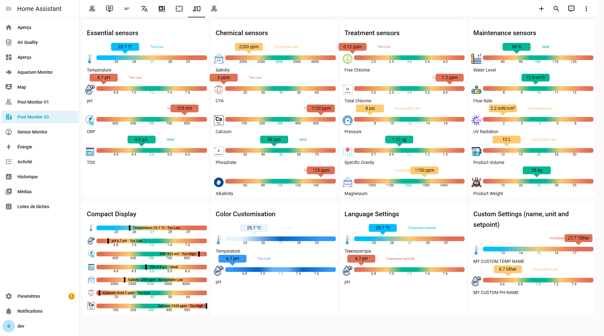

# Pool Monitor Card
[](https://github.com/wilsto/pool-monitor-card/releases) [](https://github.com/hacs/integration)


[Cliquez sur moi pour voir d'autres captures d'écran](example/screenshots.md)


## Description


Le "Pool Monitor Card" est un plugin Home Assistant qui affiche les informations de **<span style="color:orange">19 capteurs prédéfinis pour votre piscine</span>** :

<div style="display:flex; flex-direction:column; gap:15px; margin:20px 0">

<div style="display:flex; align-items:center; gap:10px">
  <div style="display:flex; gap:5px">
    
    
    
    
  </div>
  <strong>Paramètres essentiels :</strong> température, pH, ORP et TDS
</div>

<div style="display:flex; align-items:center; gap:10px">
  <div style="display:flex; gap:5px">
    
    
    
    
    
  </div>
  <strong>Équilibre chimique :</strong> salinité, acide cyanurique, calcium, phosphate et alcalinité
</div>

<div style="display:flex; align-items:center; gap:10px">
  <div style="display:flex; gap:5px">
    
    
    
    
    
  </div>
  <strong>Traitement :</strong> chlore libre/total, pression filtre, densité et magnésium
</div>

<div style="display:flex; align-items:center; gap:10px">
  <div style="display:flex; gap:5px">
    
    
    
    
    
  </div>
  <strong>Maintenance :</strong> niveau d'eau, débit, radiation UV et gestion des produits
</div>

</div>

<details>
  <summary><span style="color:blue">Cliquez sur moi pour voir les détails</span></summary>

- **Température** : Il s'agit de la température de l'eau de votre piscine. La température idéale d'une piscine se situe entre 26°C et 28°C.  Connaître la température peut vous aider à décider si l'eau est suffisamment chaude pour nager ou si elle est trop froide et doit être chauffée.

- **pH** : Il s'agit d'une mesure de l'acidité ou de l'alcalinité de l'eau de votre piscine. Le pH idéal d'une piscine se situe entre 7,0 et 7,4. Le maintien d'un niveau de pH approprié permet d'éviter les irritations de la peau et des yeux et de garder l'eau de la piscine propre à la baignade.

- **ORP** : Il s'agit du potentiel d'oxydo-réduction, qui mesure la capacité de l'eau à oxyder ou à réduire les substances présentes dans la piscine. Le niveau de ORP est lié à la quantité de chlore ou d'autres désinfectants dans la piscine.  La plage idéale pour le chlore dans une piscine se situe entre 650 et 750 mV. Le maintien d'un niveau ORP correct permet de s'assurer que l'eau de la piscine est correctement assainie et exempte de bactéries nocives.

- **TDS**: Il s'agit du total des solides dissous, qui mesure la quantité de substances inorganiques et organiques présentes dans l'eau, telles que les minéraux, les sels et d'autres particules. Des niveaux élevés de TDS peuvent affecter la clarté de l'eau et rendre difficile l'équilibre des produits chimiques dans la piscine. La plage idéale pour le TDS dans une piscine d'eau salée se situe entre 3 000 et 5 000 parties par million (ppm) (3 et 5 g/L).

- **Salinité** : Elle mesure la quantité de sel dans l'eau. Une piscine d'eau salée a besoin d'une certaine quantité de sel pour fonctionner correctement. La plage idéale de sel dans une piscine d'eau salée se situe entre 2 500 et 3 500 ppm.

- **CYA** : Il s'agit de l'acide cyanurique qui mesure la quantité de stabilisant dans l'eau. Le stabilisateur aide à protéger le chlore de la dégradation par la lumière du soleil. Le taux idéal de CYA dans une piscine se situe entre 30 et 50 ppm.

- **Calcium** : Ce paramètre mesure la quantité de calcium dans l'eau. Des niveaux élevés de calcium peuvent entraîner l'entartrage des surfaces et des équipements de la piscine. La dureté calcique idéale d'une piscine se situe entre 200 et 400 ppm.

- **Phosphate** : Ce paramètre mesure la quantité de phosphate dans l'eau. Les phosphates présents dans l'eau peuvent servir de nourriture à la croissance des algues. Le taux idéal de phosphate dans une piscine se situe entre 200 et 300 ppm.

- **Alcalinité** : Elle mesure la capacité de l'eau à résister aux changements de pH. Une alcalinité adéquate permet d'éviter que l'eau ne devienne trop acide ou trop alcaline. L'alcalinité idéale d'une piscine se situe entre 80 et 120 ppm.

- **Chlore libre** : Il s'agit de la quantité de chlore actif dans l'eau qui est disponible pour désinfecter la piscine. La plage idéale de chlore libre dans une piscine se situe entre 1 et 3 ppm.

- **Chlore total** : Il s'agit de la concentration combinée du chlore libre et du chlore qui s'est combiné aux contaminants présents dans l'eau. La plage idéale pour le chlore total dans une piscine est de 5 ppm.

- **Pression du filtre** : Elle mesure la pression à l'intérieur du filtre de la piscine. Une pression de filtre élevée peut indiquer que le filtre est sale et doit être nettoyé. La pression idéale du filtre peut varier en fonction de la marque et du modèle du filtre de la piscine.

- **Gravité spécifique** : Une mesure qui indique si un objet flottera ou coulera dans l'eau. L'eau a une gravité spécifique de 1,0 à 20°C. Ce point de référence aide à déterminer si des substances flotteront (gravité spécifique < 1) ou couleront (gravité spécifique > 1) dans l'eau. Cette propriété est importante pour la gestion des équipements et des produits chimiques de la piscine.

- **Magnésium** : Un minéral qui aide à prévenir l'entartrage et les taches dans les piscines. La plage idéale pour le magnésium dans une piscine est comprise entre 20 et 40 ppm. Des niveaux appropriés de magnésium peuvent aider à améliorer la clarté de l'eau et à réduire l'utilisation de produits chimiques.

</details>  
<br/>
Avec la "Pool Monitor Card", vous pouvez facilement contrôler ces aspects importants de votre piscine et faire les ajustements nécessaires pour que l'eau soit sûre et agréable à la baignade.

---

## Support

Hey mec ! Aide-moi pour quelques :beers: ou un :coffee:!

[](https://bmc.link/wilsto)

---

## ReadMe multilingue

Clique sur les boutons suivants pour choisir la langue de ton ReadMe : [](https://github.com/wilsto/pool-monitor-card/blob/master/README-fr.md) [](https://github.com/wilsto/pool-monitor-card/blob/master/README.md)

## Table des matières <!-- omit in toc -->

<details >
  <summary> cliquez pour ouvrir</summary>

- [Pool Monitor Card](#pool-monitor-card)
  - [ReadMe multilingue](#readme-multilingue)
  - [](#)
  - [Description](#description)
  - [Support](#support)
  - [Installation](#installation)
    - [via HACS](#via-hacs)
    - [Manuellement](#manuellement)
  - [Mise en place sous Lovelace](#mise-en-place-sous-lovelace)
    - [Utilisation de l'interface utilisateur](#utilisation-de-linterface-utilisateur)
    - [Utilisation de YAML](#utilisation-de-yaml)
      - [Exemple de code](#exemple-de-code)
    - [Paramètres principaux](#paramètres-principaux)
    - [Paramètres avancés](#paramètres-avancés)
      - [eXperience Utilisateur (UI/UX)](#experience-utilisateur-uiux)
      - [Température](#température)
      - [pH](#ph)
      - [ORP](#orp)
      - [TDS](#tds)
      - [Salinité](#salinité)
      - [Acide cyanurique](#acide-cyanurique)
      - [Calcium](#calcium)
      - [Phosphate](#phosphate)
      - [Alcalinité](#alcalinité)
      - [Chlore libre](#chlore-libre)
      - [Chlore total](#chlore-total)
      - [Pression du filtre](#pression-du-filtre)
      - [Gravité spécifique](#gravité-spécifique)
      - [Magnésium](#magnésium)
  - [Matériels](#matériels)
  - [Remerciements](#remerciements)

</details>

---


## Installation

### via HACS

En attendant que la carte "Pool Monitor Card" soit disponible par défaut dans le répertoire HACS.  cliquez sur :
[](https://my.home-assistant.io/redirect/hacs_repository/?owner=wilsto&repository=pool-monitor-card&category=plugin)

### Manuellement

1. Téléchargez le fichier `pool_monitor_card.js` depuis la [dernière version disponible](https://github.com/wilsto/pool-monitor-card/releases) et sauvegardez-le dans votre dossier `configuration/www`.
1. Allez dans `Configuration > Lovelace dashboard > Resources` dans Home Assistant et cliquez sur `Add resource`.
    1. Ajoutez `/local/community/pool-monitor-card/pool_monitor_card.js` à l'URL.
    1. Choisissez `Javascript Module` comme Resource type.

---
## Mise en place sous Lovelace

### Utilisation de l'interface utilisateur

Pas encore possible.

### Utilisation de YAML

1. Vous avez juste besoin d'ajouter une nouvelle carte avec `type : 'custom:pool-monitor-card'` à votre liste de cartes et n'importe quelle configuration que vous trouverez ci-dessous si vous voulez personnaliser davantage votre carte.

#### Exemple de code

```yaml
type: 'custom:pool-monitor-card'
temperature: sensor.your_temperature_sensor
ph: sensor.your_ph_sensor
```

### Paramètres principaux

  Voici une liste de capteurs qu'il peut être important de surveiller, en fonction des besoins spécifiques de votre piscine. Il est essentiel de maintenir les niveaux dans les plages recommandées pour que votre piscine reste saine et baignable.

  ***Tous les capteurs sont optionnels mais vous devez définir au moins une de ces entités**.

| Nom | Type | Exigence | Description | Valeur par défaut |
| -------------- | ----------- | ------------ | ------------------------------------------------ | --------------------------------------------------------------------------------------------------------------------------------------------------------------------------------------------------------------------------------------------------------------------------------------------------------------------------------------------- |
| `type` | texte | **Obligatoire** | `custom:pool-monitor-card` ||
| `temperature` | texte | **Option*** | Entité Temperature  |`aucune`|
| `ph` | texte | **Option*** | Entité pH  |`aucune`|
| `orp` | texte | **Option*** | Entité ORP  |`aucune`|
| `tds` | texte | **Option*** | Entité TDS  |`aucune`|
| `salinity` | String | **Optional*** | L'entité qui mesure le niveau de sel dans l'eau (pour les piscines d'eau salée).  |`none`|
| `cya` | String | **Optional*** |  L'entité qui mesure le niveau d'acide cyanurique dans l'eau. |`none`|
| `calcium` | String | **Optional*** | L'entité qui mesure le niveau de dureté calcique dans l'eau. |`none`|
| `phosphate` | String | **Optional*** | L'entité qui mesure le niveau de phosphate dans l'eau. |`none`|
| `free_chlorine` | String | **Optional*** | L'entité qui mesure la concentration de chlore libre dans l'eau.|`none`|
| `total_chlorine` | String | **Optional*** | L'entité qui mesure la concentration de chlore libre et de chlore combiné dans l'eau. |`none`|
| `alkalinity` | String | **Optional*** |L'entité qui mesure l'alcalinité de l'eau.  |`none`|
| `pressure` | String | **Optional*** | L'entité qui mesure la pression du filtre dans la piscine.  |`none`|
| `sg` | String | **Optional*** | L'entité qui mesure la gravité spécifique de l'eau. |`none`|
| `magnesium` | String | **Optional*** | L'entité qui mesure le niveau de magnésium dans l'eau. |`none`|

### Paramètres avancés

Vous pouvez aller plus loin avec la carte en modifiant l'interface utilisateur (UI).

#### eXperience Utilisateur (UI/UX)

| Name | Type | Requirement | Description | Default |
| -------------- | ----------- | ------------ | ------------------------------------------------ | --------------------------------------------------------------------------------------------------------------------------------------------------------------------------------------------------------------------------------------------------------------------------------------------------------------------------------------------- |
| `title` | texte | **Option** | Titre de la carte  |`aucune`|
| `compact` | booléen | **Option** | Mode Compact |`false`|
| `show_names` | booléen | **Optional** | Afficher le nom de l'entité |`true`|
| `show_labels` | booléen | **Option** | Afficher la qualification de l'état (Bas, idéal, Elevé) |`true`|
| `show_last_updated` | booléen | **Optional** | Afficher la date relative de la dernière mise à jour du capteur [Uniquement pour compact = false]. |`false`|
| `language` | texte | **Option** | Langue d'interface (12 langues supportées) - ( en,  fr,  es,  de,  it,  nl,  pt,  pt-br,  ro,  sk,  he,  ru) |`en`|

**Personnalisation des couleurs des barres**

| Nom | Type | Exigence | Description | Valeur par défaut |
| -------------- | ----------- | ------------ | ------------------------------------------------ | --------------------------------------------------------------------------------------------------------------------------------------------------------------------------------------------------------------------------------------------------------------------------------------------------------------------------------------------- |
| `normal_color` | Texte | **Option** | Couleur pour les valeurs dans la plage normale (ex: `var(--dark-primary-color)`) | `#00b894` |
| `low_color` | Texte | **Option** | Couleur pour les valeurs basses (ex: `var(--primary-color)`) | `#Fdcb6e` |
| `warn_color` | Texte | **Option** | Couleur pour les valeurs d'avertissement (ex: `var(--light-primary-color)`) | `#e17055` |
| `marker_color` | Texte | **Option** | Couleur pour les marqueurs min/max (ex: `black`) | `rgb(0, 0, 0, 1)` |
| `hi_low_color` | Texte | **Option** | Couleur pour les valeurs hautes/basses (ex: `red`) | `rgb(0, 0, 0, .6)` |


Besoin de changer l'unité, le point de consigne et les étapes ? Pas de problème, voir les paramètres additionnels ci-dessous pour chaque entité mesurée

#### Température

<details >
  <summary> cliquez pour ouvrir</summary>
| Name | Type | Requirement | Description | Default |
| -------------- | ----------- | ------------ | ------------------------------------------------ | --------------------------------------------------------------------------------------------------------------------------------------------------------------------------------------------------------------------------------------------------------------------------------------------------------------------------------------------- |
| `temperature_name` | String | **Optional** | Nom du capteur |`Temperature` <small>[Multilingue]</small>|
| `temperature_unit` | String | **Optional** | Temperature Unit (°C or °F) |`°C`|
| `temperature_setpoint` | Number | **Optional** | Temperature Set Point |If unit=°C:`27` <br/> If unit=°F:`80`|
| `temperature_step` | Number | **Optional** | Temperature Step |If unit=°C:`1` <br/> If unit=°F:`2`|
| `temperature_min` | String | **Optional** | ID de l'entité pour le minimum journalier de température |`aucun`|
| `temperature_max` | String | **Optional** | ID de l'entité pour le maximum journalier de température |`aucun`|

> **Note:** Si les entités min/max sont définies, elles apparaîtront comme des marques sur le graphique en barres.
</details>

> **_NOTE:_**  J'ai ajouté un deuxième paramètre appelé temperature_2 (avec la même logique pour le nom, l'unité, le point de consigne, le pas) pour ceux qui ont plusieurs capteurs de température.

#### pH

<details >
  <summary> cliquez pour ouvrir</summary>

| Name | Type | Requirement | Description | Default |
| -------------- | ----------- | ------------ | ------------------------------------------------ | --------------------------------------------------------------------------------------------------------------------------------------------------------------------------------------------------------------------------------------------------------------------------------------------------------------------------------------------- |
| `ph_name` | String | **Optional** | Nom du capteur |`pH` <small>[Multilingue]</small>|
| `ph_unit` | String | **Optional** | pH Unit |`pH`|
| `ph_setpoint` | Number | **Optional** | pH Set Point |`7.2`|
| `ph_step` | Number | **Optional** | pH Step |`0.2`|
| `ph_min` | String | **Optional** | ID de l'entité pour le minimum journalier de pH |`aucun`|
| `ph_max` | String | **Optional** | ID de l'entité pour le maximum journalier de pH |`aucun`|

> **Note:** Si les entités min/max sont définies, elles apparaîtront comme des marques sur le graphique en barres.
</details>

#### ORP

<details >
  <summary> cliquez pour ouvrir</summary>

| Nom | Type | Exigence | Description | Valeur par défaut |
| -------------- | ----------- | ------------ | ------------------------------------------------ | --------------------------------------------------------------------------------------------------------------------------------------------------------------------------------------------------------------------------------------------------------------------------------------------------------------------------------------------- |
| `orp_name` | String | **Optional** | Nom du capteur |`ORP` <small>[Multilingue]</small>|
| `orp_unit` | String | **Optional** | ORP Unit |`mV`|
| `orp_setpoint` | Number | **Optional** | ORP Set Point |`700`|
| `orp_step` | Number | **Optional** | ORP Step |`50`|
| `orp_min` | String | **Optional** | ID de l'entité pour le minimum journalier d'ORP |`aucun`|
| `orp_max` | String | **Optional** | ID de l'entité pour le maximum journalier d'ORP |`aucun`|

> **Note:** Si les entités min/max sont définies, elles apparaîtront comme des marques sur le graphique en barres.
</details>

#### TDS

<details >
  <summary> cliquez pour ouvrir</summary>

| Nom | Type | Exigence | Description | Valeur par défaut |
| -------------- | ----------- | ------------ | ------------------------------------------------ | --------------------------------------------------------------------------------------------------------------------------------------------------------------------------------------------------------------------------------------------------------------------------------------------------------------------------------------------- |
| `tds_name` | String | **Optional** | Nom du capteur |`TDS` <small>[Multilingue]</small>|
| `tds_unit` | String | **Optional** | TDS Unit (g/L or ppm) |`g/L`|
| `tds_setpoint` | Number | **Optional** | TDS Set Point |If unit=g/L:`4` <br/> If unit=ppm:`4000`|
| `tds_step` | Number | **Optional** | TDS Step  |If unit=g/L:`1` <br/> If unit=ppm:`1000`|
| `tds_min` | String | **Optional** | ID de l'entité pour le minimum journalier de TDS |`aucun`|
| `tds_max` | String | **Optional** | ID de l'entité pour le maximum journalier de TDS |`aucun`|

> **Note:** Si les entités min/max sont définies, elles apparaîtront comme des marques sur le graphique en barres.
</details>

#### Salinité

<details >
  <summary> cliquez pour ouvrir</summary>

| Nom | Type | Exigence | Description | Valeur par défaut |
| -------------- | ----------- | ------------ | ------------------------------------------------ | --------------------------------------------------------------------------------------------------------------------------------------------------------------------------------------------------------------------------------------------------------------------------------------------------------------------------------------------- |
| `salinity_name` | String | **Optional** | Nom du capteur |`Salinity` <small>[Multilingue]</small>|
| `salinity_unit` | String | **Optional** | Salinity Unit (ppm or mg/L) |`ppm`|
| `salinity_setpoint` | Number | **Optional** | Salinity Set Point | `3000` |
| `salinity_step` | Number | **Optional** | Salinity Step  |`500`|
| `salinity_min` | String | **Optional** | ID de l'entité pour le minimum journalier de salinité |`aucun`|
| `salinity_max` | String | **Optional** | ID de l'entité pour le maximum journalier de salinité |`aucun`|

> **Note:** Si les entités min/max sont définies, elles apparaîtront comme des marques sur le graphique en barres.
</details>

#### Acide cyanurique

<details >
  <summary> cliquez pour ouvrir</summary>

| Nom | Type | Exigence | Description | Valeur par défaut |
| -------------- | ----------- | ------------ | ------------------------------------------------ | --------------------------------------------------------------------------------------------------------------------------------------------------------------------------------------------------------------------------------------------------------------------------------------------------------------------------------------------- |
| `cya_name` | String | **Optional** | Nom du capteur |`Cyanuric Acid` <small>[Multilingue]</small>|
| `cya_unit` | String | **Optional** | Cyanuric Acid Unit |`ppm`|
| `cya_setpoint` | Number | **Optional** | Cyanuric Acid Set Point | `40` |
| `cya_step` | Number | **Optional** | Cyanuric Acid Step  |`10`|
| `cya_min` | String | **Optional** | ID de l'entité pour le minimum journalier d'acide cyanurique |`aucun`|
| `cya_max` | String | **Optional** | ID de l'entité pour le maximum journalier d'acide cyanurique |`aucun`|

> **Note:** Si les entités min/max sont définies, elles apparaîtront comme des marques sur le graphique en barres.
</details>

#### Calcium

<details >
  <summary> cliquez pour ouvrir</summary>

| Nom | Type | Exigence | Description | Valeur par défaut |
| -------------- | ----------- | ------------ | ------------------------------------------------ | --------------------------------------------------------------------------------------------------------------------------------------------------------------------------------------------------------------------------------------------------------------------------------------------------------------------------------------------- |
| `calcium_name` | String | **Optional** | Nom du capteur |`Calcium` <small>[Multilingue]</small>|
| `calcium_unit` | String | **Optional** | Calcium Unit |`ppm`|
| `calcium_setpoint` | Number | **Optional** | Calcium Set Point | `300` |
| `calcium_step` | Number | **Optional** | Calcium Step  |`100`|
| `calcium_min` | String | **Optional** | ID de l'entité pour le minimum journalier de calcium |`aucun`|
| `calcium_max` | String | **Optional** | ID de l'entité pour le maximum journalier de calcium |`aucun`|

> **Note:** Si les entités min/max sont définies, elles apparaîtront comme des marques sur le graphique en barres.
</details>

#### Phosphate

<details >
  <summary> cliquez pour ouvrir</summary>

| Nom | Type | Exigence | Description | Valeur par défaut |
| -------------- | ----------- | ------------ | ------------------------------------------------ | --------------------------------------------------------------------------------------------------------------------------------------------------------------------------------------------------------------------------------------------------------------------------------------------------------------------------------------------- |
| `phosphate_name` | String | **Optional** | Nom du capteur |`Phosphate` <small>[Multilingue]</small>|
| `phosphate_unit` | String | **Optional** | Phosphate Unit |`ppb`|
| `phosphate_setpoint` | Number | **Optional** | Phosphate Set Point | `100` |
| `phosphate_step` | Number | **Optional** | Phosphate Step  |`100`|
| `phosphate_min` | String | **Optional** | ID de l'entité pour le minimum journalier de phosphate |`aucun`|
| `phosphate_max` | String | **Optional** | ID de l'entité pour le maximum journalier de phosphate |`aucun`|

> **Note:** Si les entités min/max sont définies, elles apparaîtront comme des marques sur le graphique en barres.
</details>

#### Alcalinité

<details >
  <summary> cliquez pour ouvrir</summary>

| Nom | Type | Exigence | Description | Valeur par défaut |
| -------------- | ----------- | ------------ | ------------------------------------------------ | --------------------------------------------------------------------------------------------------------------------------------------------------------------------------------------------------------------------------------------------------------------------------------------------------------------------------------------------- |
| `alkalinity_name` | String | **Optional** | Nom du capteur |`Alkalinity` <small>[Multilingue]</small>|
| `alkalinity_unit` | String | **Optional** | Alkalinity Unit |`ppm`|
| `alkalinity_setpoint` | Number | **Optional** | Alkalinity Set Point | `100` |
| `alkalinity_step` | Number | **Optional** | Alkalinity Step  |`20`|
| `alkalinity_min` | String | **Optional** | ID de l'entité pour le minimum journalier d'alcalinité |`aucun`|
| `alkalinity_max` | String | **Optional** | ID de l'entité pour le maximum journalier d'alcalinité |`aucun`|

> **Note:** Si les entités min/max sont définies, elles apparaîtront comme des marques sur le graphique en barres.
</details>

#### Chlore libre

<details >
  <summary> cliquez pour ouvrir</summary>

| Nom | Type | Exigence | Description | Valeur par défaut |
| -------------- | ----------- | ------------ | ------------------------------------------------ | --------------------------------------------------------------------------------------------------------------------------------------------------------------------------------------------------------------------------------------------------------------------------------------------------------------------------------------------- |
| `free_chlorine_name` | String | **Optional** | Nom du capteur |`Free Chlorine` <small>[Multilingue]</small>|
| `free_chlorine_unit` | String | **Optional** | Free Chlorine Unit |`ppm`|
| `free_chlorine_setpoint` | Number | **Optional** | Free Chlorine Set Point | `2` |
| `free_chlorine_step` | Number | **Optional** | Free Chlorine Step  |`1`|
| `free_chlorine_min` | String | **Optional** | ID de l'entité pour le minimum journalier de chlore libre |`aucun`|
| `free_chlorine_max` | String | **Optional** | ID de l'entité pour le maximum journalier de chlore libre |`aucun`|

> **Note:** Si les entités min/max sont définies, elles apparaîtront comme des marques sur le graphique en barres.
</details>

#### Chlore total

<details >
  <summary> cliquez pour ouvrir</summary>

| Nom | Type | Exigence | Description | Valeur par défaut |
| -------------- | ----------- | ------------ | ------------------------------------------------ | --------------------------------------------------------------------------------------------------------------------------------------------------------------------------------------------------------------------------------------------------------------------------------------------------------------------------------------------- |
| `total_chlorine_name` | String | **Optional** | Nom du capteur |`Total Chlorine` <small>[Multilingue]</small>|
| `total_chlorine_unit` | String | **Optional** | Total Chlorine Unit |`ppm`|
| `total_chlorine_setpoint` | Number | **Optional** | Total Chlorine Set Point | `3` |
| `total_chlorine_step` | Number | **Optional** | Total Chlorine Step  |`1`|
| `total_chlorine_min` | String | **Optional** | ID de l'entité pour le minimum journalier de chlore total |`aucun`|
| `total_chlorine_max` | String | **Optional** | ID de l'entité pour le maximum journalier de chlore total |`aucun`|

> **Note:** Si les entités min/max sont définies, elles apparaîtront comme des marques sur le graphique en barres.
</details>

#### Pression du filtre

<details >
  <summary> cliquez pour ouvrir</summary>

| Nom | Type | Exigence | Description | Valeur par défaut |
| -------------- | ----------- | ------------ | ------------------------------------------------ | --------------------------------------------------------------------------------------------------------------------------------------------------------------------------------------------------------------------------------------------------------------------------------------------------------------------------------------------- |
| `pressure_name` | String | **Optional** | Nom du capteur |`Filter Pressure` <small>[Multilingue]</small>|
| `pressure_unit` | String | **Optional** | Filter Pressure Unit (psi or bar) |`psi`|
| `pressure_setpoint` | Number | **Optional** | Filter Pressure Set Point | `20` |
| `pressure_step` | Number | **Optional** | Filter Pressure Step  |`10`|
| `pressure_min` | String | **Optional** | ID de l'entité pour le minimum journalier de pression du filtre |`aucun`|
| `pressure_max` | String | **Optional** | ID de l'entité pour le maximum journalier de pression du filtre |`aucun`|

> **Note:** Si les entités min/max sont définies, elles apparaîtront comme des marques sur le graphique en barres.
</details>


#### Gravité spécifique

<details>
  <summary> cliquez pour ouvrir</summary>

| Nom | Type | Exigence | Description | Valeur par défaut |
| -------------- | ----------- | ------------ | ------------------------------------------------ | --------------------------------------------------------------------------------------------------------------------------------------------------------------------------------------------------------------------------------------------------------------------------------------------------------------------------------------------- |
| `sg_name` | String | **Optional** | Nom du capteur |`Specific Gravity` <small>[Multilingue]</small>|
| `sg_unit` | String | **Optional** | Unité de la gravité spécifique |`g/cm³`|
| `sg_setpoint` | Number | **Optional** | Point de consigne de la gravité spécifique | `1` |
| `sg_step` | Number | **Optional** | Pas de la gravité spécifique  |`0.001`|
| `sg_min` | String | **Optional** | ID de l'entité pour le minimum journalier de gravité spécifique |`aucun`|
| `sg_max` | String | **Optional** | ID de l'entité pour le maximum journalier de gravité spécifique |`aucun`|

> **Note:** Si les entités min/max sont définies, elles apparaîtront comme des marques sur le graphique en barres.
</details>

#### Magnésium

<details>
  <summary> cliquez pour ouvrir</summary>

| Nom | Type | Exigence | Description | Valeur par défaut |
| -------------- | ----------- | ------------ | ------------------------------------------------ | --------------------------------------------------------------------------------------------------------------------------------------------------------------------------------------------------------------------------------------------------------------------------------------------------------------------------------------------- |
| `magnesium_name` | String | **Optional** | Nom du capteur |`Magnesium` <small>[Multilingue]</small>|
| `magnesium_unit` | String | **Optional** | Unité du magnésium |`ppm`|
| `magnesium_setpoint` | Number | **Optional** | Point de consigne du magnésium | `700` |
| `magnesium_step` | Number | **Optional** | Pas du magnésium  |`100`|
| `magnesium_min` | String | **Optional** | ID de l'entité pour le minimum journalier de magnésium |`aucun`|
| `magnesium_max` | String | **Optional** | ID de l'entité pour le maximum journalier de magnésium |`aucun`|

> **Note:** Si les entités min/max sont définies, elles apparaîtront comme des marques sur le graphique en barres.
</details>


---

## Matériels

Voici une liste non exhaustive, non testée et non affiliée de différents matériaux susceptibles d'intégrer certaines des valeurs ci-dessus :

| Marque | Modèle  | Temp | pH | ORP | TDS | HA Support |
| -------------- | ----------- | ------------ |  ------------ |  ------------ | ------------------------------------------------ | --------------------------------------------------------------------------------------------------------------------------------------------------------------------------------------------------------------------------------------------------------------------------------------------------------------------------------------------- |
| Bluerriot | [Blue Connect](https://www.blueriiot.com/us-en) |✔️ | ✔️ |✔️ | ❌|  [Blog](https://blog.mikejmcguire.com/2021/12/30/home-assistant-add-on-for-blueriiot-blue-connect-plus/) |
| Bluerriot | [Blue Connect Plus Gold](https://www.blueriiot.com/us-en) |✔️ | ✔️ |✔️ | ✔️|  [Blog](https://blog.mikejmcguire.com/2021/12/30/home-assistant-add-on-for-blueriiot-blue-connect-plus/) |
| Flipr | [AnalysR](https://goflipr.com/flipr-analysr-3/) |✔️ | ✔️ |✔️ | ❌ | [Component](https://www.home-assistant.io/integrations/flipr/) |
| Inkbird | [IBS-P01R Bluetooth](https://pool-thermometer.eu/shop/wifi-swimming-pool-thermometer-bundle-weather-station/?lang=en) |  ✔️ | ❌ | ❌| ❌ | [Component](https://www.home-assistant.io/integrations/inkbird/) |
| iopool | [ECO](https://iopool.com/pages/pool-monitor) |  ✔️ | ✔️ | ✔️ | ❌ | [Tuto fr @mguyard](https://forum.hacf.fr/t/tuto-gestion-de-sa-piscine-avec-sonde-iopool/24292) |
| Ondilo |  [ICO Pool](https://ondilo.com/en/ico-pool/) |✔️ | ✔️ |✔️ | ✔️| [Component](https://www.home-assistant.io/integrations/ondilo_ico/) |
| Zodiac  | [iAqualink eXO iQ](https://www.zodiac-poolcare.com/traitement-de-l-eau/electrolyseurs-au-sel/gamme-exo--iq/exo--iq)  |  ✔️  | ✔️ | ✔️ |❌ | [Tuto via nodeRED](example/zodiac.md) |
| Tuya | [BLE-YL01](https://www.zigbee2mqtt.io/devices/BLE-YL01.html) | ✔️ | ✔️ | ✔️ | ✔️ | [Tuto](https://community.home-assistant.io/t/pool-monitoring-device-yieryi-ble-yl01-zigbee-ph-orp-free-chlorine-salinity-etc/659545) |

> **_NOTE:_**  ✔️ indique que le modèle est capable de mesurer le paramètre spécifié, tandis que ❌ indique qu'il ne l'est pas.
La dernière colonne concerne des infos pour le connecter à Home Assistant.

[Cliquez sur moi pour voir plus de matériel](example/hardware.md)

---

## Remerciements

Cette carte ne serait pas ce qu'elle est aujourd'hui sans nos incroyables contributeurs ! Je suis incroyablement reconnaissant envers tous ceux qui ont aidé à l'améliorer. Que vous ayez ajouté des fonctionnalités, corrigé des bugs ou aidé avec les traductions - vous êtes géniaux ! 🌟

> **Un grand merci à :**
> - [Gregtakacs](https://github.com/gregtakacs) pour avoir ajouté ces superbes marqueurs Min/Max et permis aux utilisateurs de personnaliser les couleurs de leurs barres
> - [Djgel](https://github.com/djgel) pour avoir implémenté les mesures de gravité spécifique
> - [JDeighty4](https://github.com/JDeighty4) pour avoir ajouté le support du capteur de magnésium
>  
> Et un immense merci à nos traducteurs pour avoir permis à cette carte d'être accessible dans plusieurs langues ! 🌐
> - [Sebaer1976](https://github.com/sebaer1976) et [Splitti](https://github.com/splitti) pour l'avoir rendue accessible aux germanophones
> - [Djgel](https://github.com/djgel) et [jorgemiguel4](https://github.com/jorgemiguel4) pour la traduction portugaise
> - [CosminFRC](https://github.com/CosminFRC) pour la version roumaine
> - [Misa1515](https://github.com/misa1515) pour le support slovaque
> - [ViPeR5000](https://github.com/ViPeR5000) pour la traduction polonaise
> - [Yehuda](https://github.com/Yehuda) pour l'avoir rendue accessible aux utilisateurs hébreux
> - [MrSnakeSPb](https://github.com/MrSnakeSPb) pour la traduction russe
>
> Remerciements particuliers à ceux qui ont aidé à étendre le support matériel et la compatibilité :
> - [hlaffez](https://github.com/hlaffez) pour la compatibilité avec Tuya BLE-YL01
> - [DAVIZINH0](https://github.com/DAVIZINH0) pour les informations de compatibilité avec bluerriot