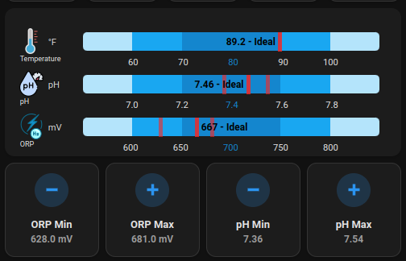

# Pool Monitor Card

[](https://github.com/hacs/integration)


[Click me to see more screenshots](example/screenshots.md)

## Multilanguage ReadMe

Click on the following button to choose the language of your ReadMe : [](https://github.com/wilsto/pool-monitor-card/blob/master/README-fr.md) [](https://github.com/wilsto/pool-monitor-card/blob/master/README.md)

## TOC <!-- omit in toc -->

<details>
  <summary> click me to open</summary>

- [Pool Monitor Card](#pool-monitor-card)
  - [Multilanguage ReadMe](#multilanguage-readme)
  - [Description](#description)
  - [Support](#support)
  - [Install](#install)
    - [via HACS](#via-hacs)
    - [Manualy](#manualy)
  - [Lovelace Set up](#lovelace-set-up)
    - [Using UI](#using-ui)
    - [Using YAML](#using-yaml)
      - [Example of code](#example-of-code)
  - [Parameters](#parameters)
    - [Sensors Options](#sensors-options)
    - [Advanced options](#advanced-options)
      - [User eXperience (UX)](#user-experience-ux)
      - [Temperature](#temperature)
      - [pH](#ph)
      - [ORP](#orp)
      - [TDS](#tds)
      - [Salinity](#salinity)
      - [Cyanuric Acid](#cyanuric-acid)
      - [Calcium](#calcium)
      - [Phosphate](#phosphate)
      - [Alkalinity](#alkalinity)
      - [Free Chlorine](#free-chlorine)
      - [Total Chlorine](#total-chlorine)
      - [Filter Pressure](#filter-pressure)
      - [Specific Gravity](#specific-gravity)
      - [Magnesium](#magnesium)
  - [Min / Max Tickers](#min--max-tickers)
  - [Hardware](#hardware)
  - [Acknowledgments](#acknowledgments)
  
</details>

---

## Description

The "Pool Monitor Card" is a home assistant plugin that display information of **<span style="color:orange">14 pre-defined sensors of your swimming pool</span>** : **temperature, pH, ORP levels and TDS**  but also if you need them : **salinity, CYA, calcium, phosphate, alkalinity, free chlorine, total chlorine, filter pressure, specific gravity**

- **Temperature**: This refers to the temperature of the water in your pool. The ideal range for temperature in a pool is between 26°C and 28°C.  Knowing the temperature can help you decide if it's warm enough for swimming or if it's too cold and might need to be heated.

- **pH**: This is a measure of how acidic or alkaline the water in your pool is. The ideal range for pH in a pool is between 7.0 and 7.4. Maintaining the proper pH level can help prevent skin and eye irritation and keep the pool water safe for swimming.

- **ORP**: This stands for Oxidation Reduction Potential and measures the ability of the water to oxidize or reduce substances in the pool. The ORP level is related to the amount of chlorine or other sanitizers in the pool.  The ideal range for chlorine in a pool is between 650 and 750 mV. Maintaining the correct ORP level can help ensure that the pool water is properly sanitized and free of harmful bacteria.

- **TDS**: This stands for Total Dissolved Solids and measures the amount of inorganic and organic substances in the water, such as minerals, salts, and other particles. High levels of TDS can affect water clarity and make it difficult to balance chemicals in the pool. The ideal range for TDS in a saltwater pool is between 3000 and 5000 parts per million (ppm) (3 and 5 g/L).

<details>
  <summary><span style="color:blue">Click me to continue to list 8 other possible sensors</span></summary>

- **Salinity**: This measures the amount of salt in the water. A saltwater pool requires a specific range of salt to function properly. The ideal range for salt in a saltwater pool is between 2500 and 3500 ppm.

- **CYA**: This stands for Cyanuric Acid and measures the amount of stabilizer in the water. Stabilizer helps to protect the chlorine from being broken down by sunlight. The ideal range for CYA in a pool is between 30 and 50 ppm.

- **Calcium**: This measures the amount of calcium in the water. High levels of calcium can lead to scaling on pool surfaces and equipment. The ideal range for calcium hardness in a pool is between 200 and 400 ppm.

- **Phosphate**: This measures the amount of phosphate in the water. Phosphates in the water can provide food for algae to grow. The ideal range for phosphate in a pool is below 200-300 ppm.

- **Alkalinity**: This measures the ability of the water to resist changes in pH. Proper alkalinity can help to prevent the water from becoming too acidic or alkaline. The ideal range for alkalinity in a pool is between 80 and 120 ppm.

- **Free Chlorine**: This measures the amount of active chlorine in the water that is available to sanitize the pool. The ideal range for free chlorine in a pool is between 1 and 3 ppm.

- **Total Chlorine**: This measures the combined concentration of both free chlorine and chlorine that has combined with contaminants in the water. The ideal range for total chlorine in a pool is up to 5 ppm.

- **Filter pressure**: This measures the pressure inside the pool filter. A high filter pressure can indicate that the filter is dirty and needs to be cleaned. The ideal filter pressure can vary depending on the make and model of the pool filter.

- **Specific Gravity**: A measure that indicates if an object will float or sink in water. Water has a specific gravity of 1.0 at 20°C. This reference point helps determine if substances will float (specific gravity < 1) or sink (specific gravity > 1) in water. This property is important for pool equipment and chemical management.

- **Magnesium**: A mineral that helps prevent scaling and staining in pools. The ideal range for magnesium in a pool is between 20 and 40 ppm. Proper magnesium levels can help improve water clarity and reduce chemical usage.

</details>  

<br/>
With the "Pool Monitor Card", you can easily monitor these important aspects of your swimming pool and make any necessary adjustments to ensure that the water is safe and comfortable for swimming.

---

## Support

Hey dude! Help me out for a couple of :beers: or a :coffee:!

[](https://bmc.link/wilsto)

---

## Install

### via HACS

Until the Home Assistant Pool Monitor card is available by default in the HACS directory, click on:
[](https://my.home-assistant.io/redirect/hacs_repository/?owner=wilsto&repository=pool-monitor-card&category=plugin)

### Manualy

1. Download the `pool_monitor_card.js` file from the [latest release available](https://github.com/wilsto/pool-monitor-card/releases) and save it in your `configuration/www` folder.
1. Go to `Configuration > Lovelace dashboard > Resources` in Home Assistant and click on `Add resource`.
    1. Add `/local/community/pool-monitor-card/pool_monitor_card.js` to the URL.
    1. Choose `Javascript Module` as Resource type.

---

## Lovelace Set up

### Using UI

Not yet possible.

### Using YAML

1. You just need to add a new empty card with `type: 'custom:pool-monitor-card'` to your cards list and any of the config that you will find below if you want to customize more your card.

#### Example of code

```yaml
type: 'custom:pool-monitor-card'
temperature: sensor.your_temperature_sensor
ph: sensor.your_ph_sensor
```

---

## Parameters

### Sensors Options

  Here's a list of sensors that may be important to monitor, depending on your pool's specific needs. Maintaining levels within the recommended ranges is essential to keep your pool healthy and swimmable.

  ***All are optionals but you need to define at least one of theses entities**
  
| Name | Type | Requirement | Description | Default |
| -------------- | ----------- | ------------ | ------------------------------------------------ | --------------------------------------------------------------------------------------------------------------------------------------------------------------------------------------------------------------------------------------------------------------------------------------------------------------------------------------------- |
| `type` | string | **Required** | `custom:pool-monitor-card` ||
| `temperature` | string | **Optional*** | The entity that measures the water temperature. |`none`|
| `ph` | string | **Optional*** | The entity that measures the acidity or basicity of the water. |`none`|
| `orp` | string | **Optional*** | The entity that measures the Oxidation Reduction Potential of the water. |`none`|
| `tds` | String | **Optional*** | The entity that measures the Total Dissolved Solids in the water. |`none`|
| `salinity` | String | **Optional*** | The entity that measures the salt level in the water (for saltwater pools). |`none`|
| `cya` | String | **Optional*** | The entity that measures the Cyanuric Acid level in the water. |`none`|
| `calcium` | String | **Optional*** | The entity that measures the Calcium Hardness level in the water. |`none`|
| `phosphate` | String | **Optional*** | The entity that measures the Phosphate level in the water. |`none`|
| `free_chlorine` | String | **Optional*** | The entity that measures the concentration of free chlorine in the water.|`none`|
| `total_chlorine` | String | **Optional*** | The entity that measures the concentration of both free chlorine and combined chlorine in the water. |`none`|
| `alkalinity` | String | **Optional*** | The entity that measures the alkalinity of the water. |`none`|
| `pressure` | String | **Optional*** | The entity that measures the filter pressure in the pool. |`none`|
| `sg` | String | **Optional*** | The entity that measures the specific gravity of the water. |`none`|
| `magnesium` | String | **Optional*** | The entity that measures the magnesium level in the water. |`none`|

### Advanced options

You can go further with the card by modifying the user interface (UI).

#### User eXperience (UX)

| Name | Type | Requirement | Description | Default |
| -------------- | ----------- | ------------ | ------------------------------------------------ | --------------------------------------------------------------------------------------------------------------------------------------------------------------------------------------------------------------------------------------------------------------------------------------------------------------------------------------------- |
| `title` | string | **Optional** | Pool Monitor Card Title |`none`|
| `compact` | boolean | **Optional** | Compact Mode |`false`|
| `show_names` | boolean | **Optional** | Display the name of the entity  |`true`|
| `show_labels` | boolean | **Optional** | Display the state qualification (Low, Ideal, High)  |`true`|
| `show_last_updated` | boolean | **Optional** | Display the last updated sensor relative date [Only for compact = false]  |`false`|
| `language` | string | **Optional** | Interface language (11 languages supported) - ( en,  fr,  es,  de,  it,  nl,  pt,  pt-br,  ro,  sk,  he)  |`en`|

**Bar Colors Customisation**
| Name | Type | Requirement | Description | Default |
| -------------- | ----------- | ------------ | ------------------------------------------------ | --------------------------------------------------------------------------------------------------------------------------------------------------------------------------------------------------------------------------------------------------------------------------------------------------------------------------------------------- |
| `normal_color` | String | **Optional** | Color for normal range values (e.g. `var(--dark-primary-color)`) | `#00b894` |
| `low_color` | String | **Optional** | Color for low range values (e.g. `var(--primary-color)`) | `#Fdcb6e` |
| `warn_color` | String | **Optional** | Color for warning range values (e.g. `var(--light-primary-color)`) | `#e17055` |
| `marker_color` | String | **Optional** | Color for min/max markers (e.g. `black`) | `rgb(0, 0, 0, 1)` |
| `hi_low_color` | String | **Optional** | Color for high/low range values (e.g. `red`) | `rgb(0, 0, 0, .6)` |


Needed to change the unit, setpoint, and steps ? No problem, see additionnal parameters below for each measured entity .

#### Temperature

<details open>
  <summary> click me to open</summary>

| Name | Type | Requirement | Description | Default |
| -------------- | ----------- | ------------ | ------------------------------------------------ | --------------------------------------------------------------------------------------------------------------------------------------------------------------------------------------------------------------------------------------------------------------------------------------------------------------------------------------------- |
| `temperature_name` | String | **Optional** | Sensor Name |`Temperature` <small>[Multilanguage]</small>|
| `temperature_unit` | String | **Optional** | Temperature Unit (°C or °F) |`°C`|
| `temperature_setpoint` | Number | **Optional** | Temperature Set Point |If unit=°C:`27` <br/> If unit=°F:`80`|
| `temperature_step` | Number | **Optional** | Temperature Step |If unit=°C:`1` <br/> If unit=°F:`2`|
| `temperature_min` | String | **Optional** | Entity ID for daily minimum temperature |`none`|
| `temperature_max` | String | **Optional** | Entity ID for daily maximum temperature |`none`|

> **Note:** If min/max entities are defined, they will appear as tick marks on the bar chart.
</details>

#### pH

<details>
  <summary> click me to open</summary>

| Name | Type | Requirement | Description | Default |
| -------------- | ----------- | ------------ | ------------------------------------------------ | --------------------------------------------------------------------------------------------------------------------------------------------------------------------------------------------------------------------------------------------------------------------------------------------------------------------------------------------- |
| `ph_name` | String | **Optional** | Sensor Name |`pH` <small>[Multilanguage]</small>|
| `ph_unit` | String | **Optional** | pH Unit |`pH`|
| `ph_setpoint` | Number | **Optional** | pH Set Point |`7.2`|
| `ph_step` | Number | **Optional** | pH Step |`0.2`|
| `ph_min` | String | **Optional** | Entity ID for daily minimum pH |`none`|
| `ph_max` | String | **Optional** | Entity ID for daily maximum pH |`none`|

> **Note:** If min/max entities are defined, they will appear as tick marks on the bar chart.
</details>

#### ORP

<details>
  <summary> click me to open</summary>

| Name | Type | Requirement | Description | Default |
| -------------- | ----------- | ------------ | ------------------------------------------------ | --------------------------------------------------------------------------------------------------------------------------------------------------------------------------------------------------------------------------------------------------------------------------------------------------------------------------------------------- |
| `orp_name` | String | **Optional** | Sensor Name |`ORP` <small>[Multilanguage]</small>|
| `orp_unit` | String | **Optional** | ORP Unit |`mV`|
| `orp_setpoint` | Number | **Optional** | ORP Set Point |`700`|
| `orp_step` | Number | **Optional** | ORP Step |`50`|
| `orp_min` | String | **Optional** | Entity ID for daily minimum ORP |`none`|
| `orp_max` | String | **Optional** | Entity ID for daily maximum ORP |`none`|

> **Note:** If min/max entities are defined, they will appear as tick marks on the bar chart.
</details>

#### TDS

<details>
  <summary> click me to open</summary>

| Name | Type | Requirement | Description | Default |
| -------------- | ----------- | ------------ | ------------------------------------------------ | --------------------------------------------------------------------------------------------------------------------------------------------------------------------------------------------------------------------------------------------------------------------------------------------------------------------------------------------- |
| `tds_name` | String | **Optional** | Sensor Name |`TDS` <small>[Multilanguage]</small>|
| `tds_unit` | String | **Optional** | TDS Unit (g/L or ppm) |`g/L`|
| `tds_setpoint` | Number | **Optional** | TDS Set Point |If unit=g/L:`4` <br/> If unit=ppm:`4000`|
| `tds_step` | Number | **Optional** | TDS Step  |If unit=g/L:`1` <br/> If unit=ppm:`1000`|
| `tds_min` | String | **Optional** | Entity ID for daily minimum TDS |`none`|
| `tds_max` | String | **Optional** | Entity ID for daily maximum TDS |`none`|

> **Note:** If min/max entities are defined, they will appear as tick marks on the bar chart.
</details>

#### Salinity

<details>
  <summary> click me to open</summary>

| Name | Type | Requirement | Description | Default |
| -------------- | ----------- | ------------ | ------------------------------------------------ | --------------------------------------------------------------------------------------------------------------------------------------------------------------------------------------------------------------------------------------------------------------------------------------------------------------------------------------------- |
| `salinity_name` | String | **Optional** | Sensor Name |`Salinity` <small>[Multilanguage]</small>|
| `salinity_unit` | String | **Optional** | Salinity Unit (ppm or g/L) |`ppm`|
| `salinity_setpoint` | Number | **Optional** | Salinity Set Point |If unit=g/L:`4.5` <br/> If unit=ppm:`3000`|
| `salinity_step` | Number | **Optional** | Salinity Step  |If unit=g/L:`0.5` <br/> If unit=ppm:`500`|
| `salinity_min` | String | **Optional** | Entity ID for daily minimum salinity |`none`|
| `salinity_max` | String | **Optional** | Entity ID for daily maximum salinity |`none`|

> **Note:** If min/max entities are defined, they will appear as tick marks on the bar chart.
</details>

#### Cyanuric Acid

<details>
  <summary> click me to open</summary>

| Name | Type | Requirement | Description | Default |
| -------------- | ----------- | ------------ | ------------------------------------------------ | --------------------------------------------------------------------------------------------------------------------------------------------------------------------------------------------------------------------------------------------------------------------------------------------------------------------------------------------- |
| `cya_name` | String | **Optional** | Sensor Name |`Cyanuric Acid` <small>[Multilanguage]</small>|
| `cya_unit` | String | **Optional** | Cyanuric Acid Unit |`ppm`|
| `cya_setpoint` | Number | **Optional** | Cyanuric Acid Set Point | `40` |
| `cya_step` | Number | **Optional** | Cyanuric Acid Step  |`10`|
| `cya_min` | String | **Optional** | Entity ID for daily minimum Cyanuric Acid |`none`|
| `cya_max` | String | **Optional** | Entity ID for daily maximum Cyanuric Acid |`none`|

> **Note:** If min/max entities are defined, they will appear as tick marks on the bar chart.
</details>

#### Calcium

<details>
  <summary> click me to open</summary>

| Name | Type | Requirement | Description | Default |
| -------------- | ----------- | ------------ | ------------------------------------------------ | --------------------------------------------------------------------------------------------------------------------------------------------------------------------------------------------------------------------------------------------------------------------------------------------------------------------------------------------- |
| `calcium_name` | String | **Optional** | Sensor Name |`Calcium` <small>[Multilanguage]</small>|
| `calcium_unit` | String | **Optional** | Calcium Unit |`ppm`|
| `calcium_setpoint` | Number | **Optional** | Calcium Set Point | `300` |
| `calcium_step` | Number | **Optional** | Calcium Step  |`100`|
| `calcium_min` | String | **Optional** | Entity ID for daily minimum calcium |`none`|
| `calcium_max` | String | **Optional** | Entity ID for daily maximum calcium |`none`|

> **Note:** If min/max entities are defined, they will appear as tick marks on the bar chart.
</details>

#### Phosphate

<details>
  <summary> click me to open</summary>

| Name | Type | Requirement | Description | Default |
| -------------- | ----------- | ------------ | ------------------------------------------------ | --------------------------------------------------------------------------------------------------------------------------------------------------------------------------------------------------------------------------------------------------------------------------------------------------------------------------------------------- |
| `phosphate_name` | String | **Optional** | Sensor Name |`Phosphate` <small>[Multilanguage]</small>|
| `phosphate_unit` | String | **Optional** | Phosphate Unit |`ppb`|
| `phosphate_setpoint` | Number | **Optional** | Phosphate Set Point | `100` |
| `phosphate_step` | Number | **Optional** | Phosphate Step  |`100`|
| `phosphate_min` | String | **Optional** | Entity ID for daily minimum phosphate |`none`|
| `phosphate_max` | String | **Optional** | Entity ID for daily maximum phosphate |`none`|

> **Note:** If min/max entities are defined, they will appear as tick marks on the bar chart.
</details>

#### Alkalinity

<details>
  <summary> click me to open</summary>

| Name | Type | Requirement | Description | Default |
| -------------- | ----------- | ------------ | ------------------------------------------------ | --------------------------------------------------------------------------------------------------------------------------------------------------------------------------------------------------------------------------------------------------------------------------------------------------------------------------------------------- |
| `alkalinity_name` | String | **Optional** | Sensor Name |`Alkalinity` <small>[Multilanguage]</small>|
| `alkalinity_unit` | String | **Optional** | Alkalinity Unit |`ppm`|
| `alkalinity_setpoint` | Number | **Optional** | Alkalinity Set Point | `100` |
| `alkalinity_step` | Number | **Optional** | Alkalinity Step  |`20`|
| `alkalinity_min` | String | **Optional** | Entity ID for daily minimum alkalinity |`none`|
| `alkalinity_max` | String | **Optional** | Entity ID for daily maximum alkalinity |`none`|

> **Note:** If min/max entities are defined, they will appear as tick marks on the bar chart.
</details>

#### Free Chlorine

<details>
  <summary> click me to open</summary>

| Name | Type | Requirement | Description | Default |
| -------------- | ----------- | ------------ | ------------------------------------------------ | --------------------------------------------------------------------------------------------------------------------------------------------------------------------------------------------------------------------------------------------------------------------------------------------------------------------------------------------- |
| `free_chlorine_name` | String | **Optional** | Sensor Name |`Free Chlorine` <small>[Multilanguage]</small>|
| `free_chlorine_unit` | String | **Optional** | Free Chlorine Unit |`ppm`|
| `free_chlorine_setpoint` | Number | **Optional** | Free Chlorine Set Point | `2` |
| `free_chlorine_step` | Number | **Optional** | Free Chlorine Step  |`1`|
| `free_chlorine_min` | String | **Optional** | Entity ID for daily minimum free chlorine |`none`|
| `free_chlorine_max` | String | **Optional** | Entity ID for daily maximum free chlorine |`none`|

> **Note:** If min/max entities are defined, they will appear as tick marks on the bar chart.
</details>

#### Total Chlorine

<details>
  <summary> click me to open</summary>

| Name | Type | Requirement | Description | Default |
| -------------- | ----------- | ------------ | ------------------------------------------------ | --------------------------------------------------------------------------------------------------------------------------------------------------------------------------------------------------------------------------------------------------------------------------------------------------------------------------------------------- |
| `total_chlorine_name` | String | **Optional** | Sensor Name |`Total Chlorine` <small>[Multilanguage]</small>|
| `total_chlorine_unit` | String | **Optional** | Total Chlorine Unit |`ppm`|
| `total_chlorine_setpoint` | Number | **Optional** | Total Chlorine Set Point | `3` |
| `total_chlorine_step` | Number | **Optional** | Total Chlorine Step  |`1`|
| `total_chlorine_min` | String | **Optional** | Entity ID for daily minimum total chlorine |`none`|
| `total_chlorine_max` | String | **Optional** | Entity ID for daily maximum total chlorine |`none`|

> **Note:** If min/max entities are defined, they will appear as tick marks on the bar chart.
</details>

#### Filter Pressure

<details>
  <summary> click me to open</summary>

| Name | Type | Requirement | Description | Default |
| -------------- | ----------- | ------------ | ------------------------------------------------ | --------------------------------------------------------------------------------------------------------------------------------------------------------------------------------------------------------------------------------------------------------------------------------------------------------------------------------------------- |
| `pressure_name` | String | **Optional** | Sensor Name |`Filter Pressure` <small>[Multilanguage]</small>|
| `pressure_unit` | String | **Optional** | Filter Pressure Unit (psi or bar) |`psi`|
| `pressure_setpoint` | Number | **Optional** | Filter Pressure Set Point | `20` |
| `pressure_step` | Number | **Optional** | Filter Pressure Step  |`10`|
| `pressure_min` | String | **Optional** | Entity ID for daily minimum filter pressure |`none`|
| `pressure_max` | String | **Optional** | Entity ID for daily maximum filter pressure |`none`|

> **Note:** If min/max entities are defined, they will appear as tick marks on the bar chart.
</details>


#### Specific Gravity

<details>
  <summary> click me to open</summary>

| Name | Type | Requirement | Description | Default |
| -------------- | ----------- | ------------ | ------------------------------------------------ | --------------------------------------------------------------------------------------------------------------------------------------------------------------------------------------------------------------------------------------------------------------------------------------------------------------------------------------------- |
| `sg_name` | String | **Optional** | Sensor Name |`Specific Gravity` <small>[Multilanguage]</small>|
| `sg_setpoint` | Number | **Optional** | Specific Gravity Set Point | `1` |
| `sg_step` | Number | **Optional** | Specific Gravity Step  |`0.001`|
| `sg_min` | String | **Optional** | Entity ID for daily minimum specific gravity |`none`|
| `sg_max` | String | **Optional** | Entity ID for daily maximum specific gravity |`none`|

> **Note:** If min/max entities are defined, they will appear as tick marks on the bar chart.
</details>

#### Magnesium

<details>
  <summary> click me to open</summary>

| Name | Type | Requirement | Description | Default |
| -------------- | ----------- | ------------ | ------------------------------------------------ | --------------------------------------------------------------------------------------------------------------------------------------------------------------------------------------------------------------------------------------------------------------------------------------------------------------------------------------------- |
| `magnesium_name` | String | **Optional** | Sensor Name |`Magnesium` <small>[Multilanguage]</small>|
| `magnesium_unit` | String | **Optional** | Magnesium Unit |`ppm`|
| `magnesium_setpoint` | Number | **Optional** | Magnesium Set Point | `700` |
| `magnesium_step` | Number | **Optional** | Magnesium Step  |`100`|
| `magnesium_min` | String | **Optional** | Entity ID for daily minimum magnesium |`none`|
| `magnesium_max` | String | **Optional** | Entity ID for daily maximum magnesium |`none`|

> **Note:** If min/max entities are defined, they will appear as tick marks on the bar chart.
</details>

---

## Min / Max Tickers

Min/max entities defined in the YAML configuration will be displayed as tick marks on the bar chart, as shown in the example below:

 ```yaml
ph: sensor.iopool_ph
ph_min: sensor.daily_ph_min
ph_max: sensor.daily_ph_max
 ```

They will display as tick marks on the bar chart.



For the sensors I use the statistics platform:
 ```yaml
sensor:
  - platform: statistics
    name: "Daily pH Min"
    unique_id: <UUID>
    entity_id: sensor.iopool_ph
    state_characteristic: value_min
    max_age:
      hours: 24
  - platform: statistics
    name: "Daily pH Max"
    unique_id: <UUID>
    entity_id: sensor.iopool_ph
    state_characteristic: value_max
    max_age:
      hours: 24
 ```

---
  
## Hardware

Here is a non-exhaustive, non-tested and non-affiliated list of different materials that may capture some of the above values:

| Brand | Model  | Temp | pH | ORP | TDS | HA Support |
| -------------- | ----------- | ------------ |  ------------ |  ------------ | ------------------------------------------------ | --------------------------------------------------------------------------------------------------------------------------------------------------------------------------------------------------------------------------------------------------------------------------------------------------------------------------------------------- |
| Bluerriot | [Blue Connect Plus Gold](https://www.blueriiot.com/us-en) |✔️ | ✔️ |✔️ | ✔️|  [Blog](https://blog.mikejmcguire.com/2021/12/30/home-assistant-add-on-for-blueriiot-blue-connect-plus/) |
| Flipr | [AnalysR](https://goflipr.com/flipr-analysr-3/) |✔️ | ✔️ |✔️ | ❌ | [Component](https://www.home-assistant.io/integrations/flipr/) |
| Inkbird | [IBS-P01R Bluetooth](https://pool-thermometer.eu/shop/wifi-swimming-pool-thermometer-bundle-weather-station/?lang=en) |  ✔️ | ❌ | ❌| ❌ | [Component](https://www.home-assistant.io/integrations/inkbird/) |
| iopool | [ECO](https://iopool.com/pages/pool-monitor) |  ✔️ | ✔️ | ✔️ | ❌ | [Tuto fr @mguyard](https://forum.hacf.fr/t/tuto-gestion-de-sa-piscine-avec-sonde-iopool/24292) |
| Ondilo |  [ICO Pool](https://ondilo.com/en/ico-pool/) |✔️ | ✔️ |✔️ | ✔️| [Component](https://www.home-assistant.io/integrations/ondilo_ico/) |
| Zodiac  | [iAqualink eXO iQ](https://www.zodiac-poolcare.com/traitement-de-l-eau/electrolyseurs-au-sel/gamme-exo--iq/exo--iq)  |  ✔️  | ✔️ | ✔️ |❌ | [Tuto via nodeRED](example/zodiac.md) |
| Tuya | [BLE-YL01](https://www.zigbee2mqtt.io/devices/BLE-YL01.html) | ✔️ | ✔️ | ✔️ | ✔️ | [Tuto](https://community.home-assistant.io/t/pool-monitoring-device-yieryi-ble-yl01-zigbee-ph-orp-free-chlorine-salinity-etc/659545) |

> **_NOTE:_**  ✔️ indicates that the model is able to measure the specified parameter, while ❌ indicates it is not.
The last column is about info to connect it to Home Assistant.

[Click me to see more hardware](example/hardware.md)

---
## Acknowledgments

This card wouldn't be what it is today without our amazing contributors! I'm incredibly grateful for everyone who has helped make it better. Whether you've added features, fixed bugs, or helped with translations - you rock! 🌟

> **A Big Thank You To:**
> - [Gregtakacs](https://github.com/gregtakacs) for adding those awesome Min/Max Tickers and letting users customize their bar colors
> - [Djgel](https://github.com/djgel) for implementing specific gravity measurements
> - [JDeighty4](https://github.com/JDeighty4) for adding magnesium sensor support
> 
> And a special shoutout to our translation heroes who helped make this card available in multiple languages! 🌍
> - [Sebaer1976](https://github.com/sebaer1976) and [Splitti](https://github.com/splitti) for bringing it to German speakers
> - [Djgel](https://github.com/djgel) for the Portuguese translation
> - [CosminFRC](https://github.com/CosminFRC) for the Romanian version
> - [Misa1515](https://github.com/misa1515) for Slovak support
> - [ViPeR5000](https://github.com/ViPeR5000) for the Polish translation
> - [Yehuda](https://github.com/Yehuda) for making it accessible to Hebrew users
