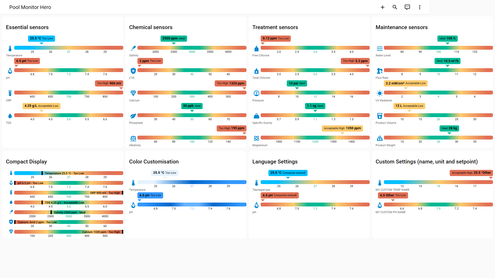
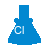
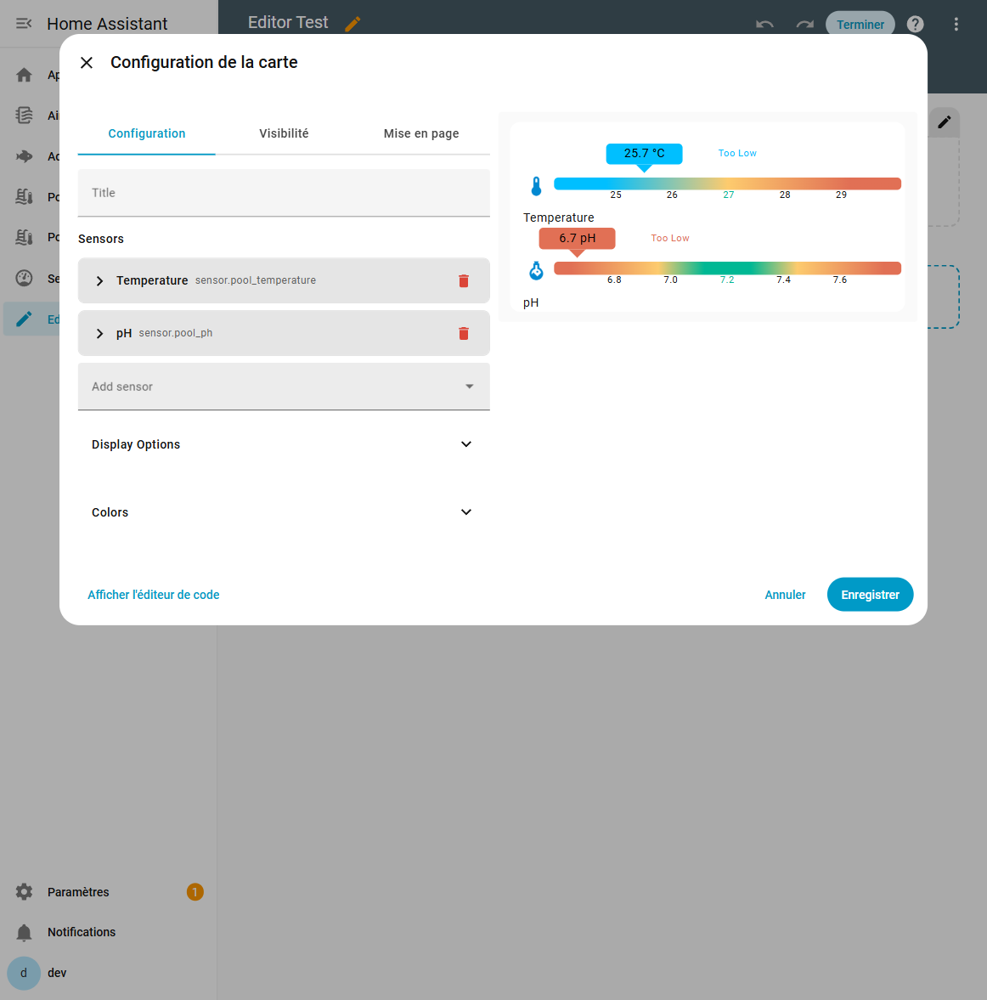

# Pool Monitor Card

[![Release][release-shield]][release-link] [![HACS][hacs-shield]][hacs-link] [![GitHub Activity][commits-shield]][commits-link]

> Keep your swimming pool safe and crystal clear by monitoring up to 25 water chemistry parameters at a glance.
>
> **Visual editor included** — configure everything from the UI, no YAML needed.



[See all configurations and visual tests](example/screenshots.md)

> **Upgrading from v1?** The sensor configuration format changed in v2. See the [Migration Guide](docs/MIGRATION.md).

---

## Why this card?

Whether you have a chlorine pool, a saltwater system, or a heated spa, this card gives you an **instant visual overview** of your water quality — right from your Home Assistant dashboard.

Color-coded gradient bars show you at a glance if each parameter is in its ideal range. No need to memorize numbers or look up charts.

Preset ideal ranges for all 20 pool parameters mean you can get started with just an entity ID — the card knows what "good" looks like for pool water.

### What you can do

- Check if the water is safe **before letting the kids swim**
- Monitor pH and ORP trends **after adding chemicals** to see the effect over time
- Track chlorine levels to catch **sanitization drops early**
- Watch filter pressure to know **when to backwash**
- Compare pool vs. spa temperature with **multiple sensors per type**

---

## Sensors (25 presets)

Every sensor comes with **preset ideal ranges** — just point to your entity and the card handles the rest. Override any value to match your setup.

### Essential Water Chemistry

*The core parameters every pool owner should monitor for safe, comfortable swimming.*

    

| Sensor | Key | Unit | Default Setpoint |
|--------|-----|------|:----------------:|
| Temperature | `temperature` | °C | 27 |
| pH | `ph` | pH | 7.2 |
| ORP | `orp` | mV | 700 |
| TDS | `tds` | g/L | 5 |
| Electrical Conductivity | `ec` | µS/cm | 4000 |

### Chemical Balance

*Keeping these balanced prevents algae, scaling, and equipment damage.*

    

| Sensor | Key | Unit | Default Setpoint |
|--------|-----|------|:----------------:|
| Salinity | `salinity` | ppm | 3000 |
| Cyanuric Acid | `cya` | ppm | 40 |
| Calcium | `calcium` | ppm | 300 |
| Phosphate | `phosphate` | ppb | 50 |
| Alkalinity | `alkalinity` | ppm | 100 |

### Treatment & Sanitization

*These tell you if your disinfection system is working properly.*

      

| Sensor | Key | Unit | Default Setpoint |
|--------|-----|------|:----------------:|
| Free Chlorine | `free_chlorine` | ppm | 3 |
| Total Chlorine | `total_chlorine` | ppm | 3 |
| Bromine | `bromine` | ppm | 4 |
| Filter Pressure | `pressure` | psi | 12 |
| Specific Gravity | `specific_gravity` | sg | 1.1 |
| Magnesium | `magnesium` | ppm | 1200 |
| Chlorinator Setting | `chlorinator` | % | 50 |

### Equipment & Maintenance

*Track the health of your pool equipment and supply levels.*

       

| Sensor | Key | Unit | Default Setpoint |
|--------|-----|------|:----------------:|
| Water Level | `water_level` | % | 100 |
| Flow Rate | `flow_rate` | m³/h | 10 |
| UV Radiation | `uv_radiation` | mW/cm² | 4 |
| Product Volume | `product_volume` | L | 20 |
| Product Weight | `product_weight` | kg | 25 |
| Pump Speed | `pump_speed` | % | 50 |
| Light Brightness | `light_brightness` | % | 80 |
| Heat Pump Setpoint | `heat_pump_setpoint` | °C | 28 |

> **Hayward OmniLogic users**: The `chlorinator`, `pump_speed` and `heat_pump_setpoint` presets map directly to OmniLogic entities (`sensor.*_chlorinator_setting`, `sensor.*_pump_speed`, etc.). Use `availability_entity` to gray out equipment rows when the device is off.

For detailed explanations of each sensor and why it matters, see [Sensor Details](docs/sensors.md).

---

## Compatible Hardware

Community-tested devices and their supported parameters:

| Brand | Model | Temp | pH | ORP | TDS | HA Support |
|-------|-------|:----:|:--:|:---:|:---:|------------|
| Bluerriot | [Bluerriot Blue Connect](https://www.blueriiot.com/us-en) | ✔️ | ✔️ | ✔️ | ❌ | [Blog](https://blog.mikejmcguire.com/2021/12/30/home-assistant-add-on-for-blueriiot-blue-connect-plus/) |
| Bluerriot | [Bluerriot Blue Connect Plus Gold](https://www.blueriiot.com/us-en) | ✔️ | ✔️ | ✔️ | ✔️ | [Blog](https://blog.mikejmcguire.com/2021/12/30/home-assistant-add-on-for-blueriiot-blue-connect-plus/) |
| Flipr | [Flipr AnalysR](https://goflipr.com/flipr-analysr-3/) | ✔️ | ✔️ | ✔️ | ❌ | [Component](https://www.home-assistant.io/integrations/flipr/) |
| Inkbird | [Inkbird IBS-P01R](https://pool-thermometer.eu/shop/wifi-swimming-pool-thermometer-bundle-weather-station/?lang=en) | ✔️ | ❌ | ❌ | ❌ | [Component](https://www.home-assistant.io/integrations/inkbird/) |
| iopool | [iopool ECO](https://iopool.com/pages/pool-monitor) | ✔️ | ✔️ | ✔️ | ❌ | [Tuto fr](https://forum.hacf.fr/t/tuto-gestion-de-sa-piscine-avec-sonde-iopool/24292) |
| Ondilo | [Ondilo ICO Pool](https://ondilo.com/en/ico-pool/) | ✔️ | ✔️ | ✔️ | ✔️ | [Component](https://www.home-assistant.io/integrations/ondilo_ico/) |
| Zodiac | [Zodiac iAqualink eXO iQ](https://www.zodiac-poolcare.com/traitement-de-l-eau/electrolyseurs-au-sel/gamme-exo--iq/exo--iq) | ✔️ | ✔️ | ✔️ | ❌ | [Tuto via nodeRED](example/zodiac.md) |
| Tuya | [Tuya BLE-YL01](https://www.zigbee2mqtt.io/devices/BLE-YL01.html) | ✔️ | ✔️ | ✔️ | ✔️ | [Tuto](https://community.home-assistant.io/t/pool-monitoring-device-yieryi-ble-yl01-zigbee-ph-orp-free-chlorine-salinity-etc/659545) |
| Hayward | [OmniLogic / OmniPL](https://www.hayward.com/shop/controls/omni-controls) | ✔️ | ✔️ | ✔️ | ❌ | [Component](https://www.home-assistant.io/integrations/omnilogic/) |

> ✔️ = supported, ❌ = not supported. [See more hardware](example/hardware.md)

> Know a device that works? [Open an issue](https://github.com/wilsto/pool-monitor-card/issues) to add it!

---

## Installation

### HACS (recommended)

1. Open [HACS](https://hacs.xyz/) → **Frontend** → search for **Pool Monitor Card**
2. Install and reload your browser

[](https://my.home-assistant.io/redirect/hacs_repository/?owner=wilsto&repository=pool-monitor-card&category=plugin)

### Manual

1. Download `pool-monitor-card.js` from the [latest release](https://github.com/wilsto/pool-monitor-card/releases)
2. Copy to `config/www/community/pool-monitor-card/`
3. Add resource: `/local/community/pool-monitor-card/pool-monitor-card.js` (type: module)

---

## Quick Start

### Visual Editor (recommended)

1. In your dashboard, click **Edit Dashboard** (pencil icon)
2. Click **+ Add Card** → select **Manual** → type `custom:pool-monitor-card`
3. Click **Show Visual Editor** to configure sensors, display options and colors — no YAML needed



### YAML

```yaml
type: custom:pool-monitor-card
title: "My Pool"
sensors:
  temperature:
    entity: sensor.your_temperature_sensor
  ph:
    entity: sensor.your_ph_sensor
  orp:
    entity: sensor.your_orp_sensor
```

That's it! The card uses sensible defaults for everything else.

---

## Configuration

> All options below are also available in the visual editor.

| Option | Type | Default | Description |
|--------|------|---------|-------------|
| `title` | string | — | Card title |
| `sensors` | object | — | Sensor definitions (see below) |
| `display.compact` | boolean | `false` | Compact display mode |
| `display.show_names` | boolean | `true` | Show sensor names |
| `display.show_icons` | boolean | `true` | Show sensor icons |
| `display.show_units` | boolean | `true` | Show units |
| `display.show_labels` | boolean | `true` | Show range labels |
| `display.gradient` | boolean | `true` | Show gradient bar |
| `display.show_last_updated` | boolean | `false` | Show last update time |
| `display.show_icons` | boolean | `true` | Show sensor icons |
| `language` | string | `en` | Language code |

### Per-sensor options

```yaml
sensors:
  temperature:
    entity: sensor.xxx        # required
    name: Custom Name         # override display name
    unit: "°C"                # override unit
    setpoint: 25              # ideal value
    min: 10                   # min of the range
    max: 40                   # max of the range
    step: 2                   # threshold step for colors
    icon: mdi:thermometer     # MDI icon
    mode: centric             # centric | heatflow
    availability_entity: binary_sensor.heat_pump  # gray out when off/unavailable
```

| Option | Type | Description |
|--------|------|-------------|
| `entity` | string | **Required.** Entity ID |
| `name` | string | Override display name |
| `unit` | string | Override unit |
| `setpoint` | number | Ideal value |
| `min` / `max` | number | Range boundaries |
| `step` | number | Threshold step for colors |
| `icon` | string | MDI icon (e.g. `mdi:thermometer`) |
| `mode` | string | `centric` or `heatflow` |
| `availability_entity` | string | Entity to track — grays out the row when `off` or `unavailable` |

### Color modes

| Mode | Gradient | Badge color | Best for |
|------|----------|-------------|----------|
| `centric` | warn → low → **normal** → low → warn | Matches gradient zone | pH, ORP — ideal value in the center |
| `heatflow` | cool → low → warn (blue → orange → red) | **Green** when ideal | Temperature — natural thermal scale |

In **centric** mode, the gradient and badge use the same colors — you see at a glance which zone the value is in.

In **heatflow** mode, the gradient shows the physical temperature scale (cold to hot), while the badge uses green to indicate the value is in the ideal range. Two complementary readings: *where* on the scale vs *is it good*.

### Multiple sensors of the same type

```yaml
sensors:
  temperature:
    - entity: sensor.sensor_1
      name: Location 1
    - entity: sensor.sensor_2
      name: Location 2
```

### Languages

12 languages supported: 🇬🇧 English, 🇫🇷 French, 🇩🇪 German, 🇪🇸 Spanish, 🇮🇹 Italian, 🇵🇹 Portuguese, 🇳🇱 Dutch, 🇵🇱 Polish, 🇨🇿 Czech, 🇸🇰 Slovak, 🇮🇱 Hebrew, 🇷🇺 Russian.

---

## Support

[](https://bmc.link/wilsto)

---

## Acknowledgments

This card wouldn't be what it is today without our amazing contributors!

- [Gregtakacs](https://github.com/gregtakacs) — Min/Max Tickers and custom bar colors
- [Djgel](https://github.com/djgel) — Specific gravity measurements + Portuguese translation
- [JDeighty4](https://github.com/JDeighty4) — Magnesium sensor support
- [Sebaer1976](https://github.com/sebaer1976) — German translation
- [Splitti](https://github.com/splitti) — German translation
- [jorgemiguel4](https://github.com/jorgemiguel4) — Portuguese translation
- [CosminFRC](https://github.com/CosminFRC) — Romanian translation
- [Misa1515](https://github.com/misa1515) — Slovak translation
- [ViPeR5000](https://github.com/ViPeR5000) — Polish translation
- [Yehuda](https://github.com/Yehuda) — Hebrew translation
- [MrSnakeSPb](https://github.com/MrSnakeSPb) — Russian translation
- [hlaffez](https://github.com/hlaffez) — Tuya BLE-YL01 compatibility
- [DAVIZINH0](https://github.com/DAVIZINH0) — Bluerriot compatibility information
- [Sangoku](https://github.com/Sangoku) — Bromine sensor support
- [smashtup](https://github.com/smashtup) — Display precision fix (Entity Registry)
- [taczirjak](https://github.com/taczirjak) — Hungarian translation
- [KIDNORswe](https://github.com/KIDNORswe) — Swedish translation
- [FejbyK](https://github.com/FejbyK) — Czech translation

## Monitor Cards Family

This card is part of the **monitor-cards** family — same rendering engine, same features, different presets:

| Card | For | Sensors |
|------|-----|---------|
| [Pool Monitor Card](https://github.com/wilsto/pool-monitor-card) | Pool & spa owners | 25 presets ← *you are here* |
| [Aquarium Monitor Card](https://github.com/wilsto/aquarium-monitor-card) | Freshwater & saltwater aquarium keepers | 15 presets |
| [Air Quality Card](https://github.com/wilsto/air-quality-card) | Homeowners concerned about indoor air quality | 12 presets |
| [Sensor Monitor Card](https://github.com/wilsto/sensor-monitor-card) | Home Assistant power users | unlimited (custom) |

<!-- Badges -->
[release-shield]: https://img.shields.io/github/v/release/wilsto/pool-monitor-card?style=flat-square
[release-link]: https://github.com/wilsto/pool-monitor-card/releases/latest
[hacs-shield]: https://img.shields.io/badge/HACS-Default-orange.svg?style=flat-square
[hacs-link]: https://hacs.xyz/
[commits-shield]: https://img.shields.io/github/commit-activity/y/wilsto/pool-monitor-card?style=flat-square
[commits-link]: https://github.com/wilsto/pool-monitor-card/commits/main