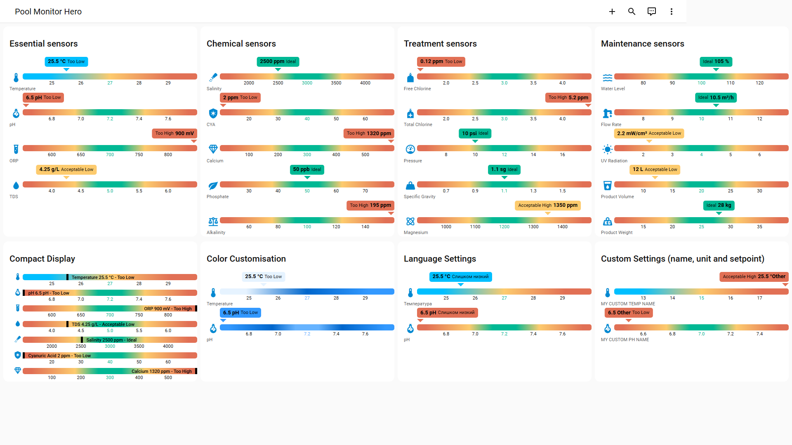

# Pool Monitor Card

[![Release][release-shield]][release-link] [![HACS][hacs-shield]][hacs-link] [![GitHub Activity][commits-shield]][commits-link]

> Keep your swimming pool safe and crystal clear by monitoring up to 20 water chemistry parameters at a glance.



[See all configurations and visual tests](example/screenshots.md)

> **Upgrading from v1?** The sensor configuration format changed in v2. See the [Migration Guide](docs/MIGRATION.md).

---

## Why this card?

Whether you have a chlorine pool, a saltwater system, or a heated spa, this card gives you an **instant visual overview** of your water quality, right from your Home Assistant dashboard.

Color-coded gradient bars show you at a glance if each parameter is in its ideal range. No need to memorize numbers or look up charts.

Preset ideal ranges for all 20 pool parameters mean you can get started with just an entity ID: the card knows what "good" looks like for pool water.

### What you can do

- Check if the water is safe **before letting the kids swim**
- Monitor pH and ORP trends **after adding chemicals** to see the effect over time
- Track chlorine levels to catch **sanitization drops early**
- Watch filter pressure to know **when to backwash**
- Compare pool vs. spa temperature with **multiple sensors per type**

---

## Sensors (28 presets)

Every sensor comes with **preset ideal ranges**: just point to your entity and the card handles the rest. Override any value to match your setup.

### Essential Water Chemistry

*The core parameters every pool owner should monitor for safe, comfortable swimming.*

    

| Sensor | Key | Unit | Default Setpoint |
|--------|-----|------|:----------------:|
| Temperature | `temperature` | °C | 27 |
| pH | `ph` | pH | 7.2 |
| ORP | `orp` | mV | 700 |
| TDS | `tds` | g/L | 5 |
| Electrical Conductivity | `ec` | µS/cm | 4000 |

### Chemical Balance

*Keeping these balanced prevents algae, scaling, and equipment damage.*

    

| Sensor | Key | Unit | Default Setpoint |
|--------|-----|------|:----------------:|
| Salinity | `salinity` | ppm | 3000 |
| Cyanuric Acid | `cya` | ppm | 40 |
| Calcium | `calcium` | ppm | 300 |
| Phosphate | `phosphate` | ppb | 50 |
| Alkalinity | `alkalinity` | ppm | 100 |

### Treatment & Sanitization

*These tell you if your disinfection system is working properly.*

     

| Sensor | Key | Unit | Default Setpoint |
|--------|-----|------|:----------------:|
| Free Chlorine | `free_chlorine` | ppm | 3 |
| Total Chlorine | `total_chlorine` | ppm | 3 |
| Bromine | `bromine` | ppm | 4 |
| Filter Pressure | `pressure` | psi | 12 |
| Specific Gravity | `specific_gravity` | sg | 1.1 |
| Magnesium | `magnesium` | ppm | 1200 |

### Equipment & Maintenance

*Track the health of your pool equipment and supply levels.*

           

| Sensor | Key | Unit | Default Setpoint |
|--------|-----|------|:----------------:|
| Water Level | `water_level` | % | 100 |
| Flow Rate | `flow_rate` | m³/h | 10 |
| UV Radiation | `uv_radiation` | mW/cm² | 4 |
| Product Volume | `product_volume` | L | 20 |
| Product Weight | `product_weight` | kg | 25 |
| Chlorinator Setting | `chlorinator` | % | 50 |
| Pump Speed | `pump_speed` | % | 50 |
| Light Brightness | `light_brightness` | % | 80 |
| Heat Pump Setpoint | `heat_pump_setpoint` | °C | 28 |
| Humidity | `humidity` | % | 60 |
| Filtration Time | `filtration_time` | h | 8 |
| Pump Energy | `pump_energy` | kWh | 5 |

For detailed explanations of each sensor and why it matters, see [Sensor Details](docs/sensors.md).

---

## Compatible Hardware

Community-tested devices and their supported parameters:

| Brand | Model | Temp | pH | ORP | TDS | HA Support |
|-------|-------|:----:|:--:|:---:|:---:|------------|
| Bluerriot | [Bluerriot Blue Connect](https://www.blueriiot.com/us-en) | ✔️ | ✔️ | ✔️ | ❌ | [Blog](https://blog.mikejmcguire.com/2021/12/30/home-assistant-add-on-for-blueriiot-blue-connect-plus/) |
| Bluerriot | [Bluerriot Blue Connect Plus Gold](https://www.blueriiot.com/us-en) | ✔️ | ✔️ | ✔️ | ✔️ | [Blog](https://blog.mikejmcguire.com/2021/12/30/home-assistant-add-on-for-blueriiot-blue-connect-plus/) |
| Flipr | [Flipr AnalysR](https://goflipr.com/flipr-analysr-3/) | ✔️ | ✔️ | ✔️ | ❌ | [Component](https://www.home-assistant.io/integrations/flipr/) |
| Inkbird | [Inkbird IBS-P01R](https://pool-thermometer.eu/shop/wifi-swimming-pool-thermometer-bundle-weather-station/?lang=en) | ✔️ | ❌ | ❌ | ❌ | [Component](https://www.home-assistant.io/integrations/inkbird/) |
| iopool | [iopool ECO](https://iopool.com/pages/pool-monitor) | ✔️ | ✔️ | ✔️ | ❌ | [Tuto fr](https://forum.hacf.fr/t/tuto-gestion-de-sa-piscine-avec-sonde-iopool/24292) |
| Ondilo | [Ondilo ICO Pool](https://ondilo.com/en/ico-pool/) | ✔️ | ✔️ | ✔️ | ✔️ | [Component](https://www.home-assistant.io/integrations/ondilo_ico/) |
| Zodiac | [Zodiac iAqualink eXO iQ](https://www.zodiac-poolcare.com/traitement-de-l-eau/electrolyseurs-au-sel/gamme-exo--iq/exo--iq) | ✔️ | ✔️ | ✔️ | ❌ | [Tuto via nodeRED](example/zodiac.md) |
| Tuya | [Tuya BLE-YL01](https://www.zigbee2mqtt.io/devices/BLE-YL01.html) | ✔️ | ✔️ | ✔️ | ✔️ | [Tuto](https://community.home-assistant.io/t/pool-monitoring-device-yieryi-ble-yl01-zigbee-ph-orp-free-chlorine-salinity-etc/659545) |

> ✔️ = supported, ❌ = not supported. [See more hardware](example/hardware.md)

> Know a device that works? [Open an issue](https://github.com/wilsto/pool-monitor-card/issues) to add it!

---

## Installation

### HACS (recommended)

1. Open [HACS](https://hacs.xyz/) → **Frontend** → search for **Pool Monitor Card**
2. Install and reload your browser

[](https://my.home-assistant.io/redirect/hacs_repository/?owner=wilsto&repository=pool-monitor-card&category=plugin)

### Manual

1. Download `pool-monitor-card.js` from the [latest release](https://github.com/wilsto/pool-monitor-card/releases)
2. Copy to `config/www/community/pool-monitor-card/`
3. Add resource: `/local/community/pool-monitor-card/pool-monitor-card.js` (type: module)

---

## Quick Start

```yaml
type: custom:pool-monitor-card
title: "My Pool"
sensors:
  temperature:
    entity: sensor.your_temperature_sensor
  ph:
    entity: sensor.your_ph_sensor
  orp:
    entity: sensor.your_orp_sensor
```

That's it! The card uses sensible defaults for everything else.

---

## Configuration

| Option | Type | Default | Description |
|--------|------|---------|-------------|
| `title` | string | - | Card title |
| `sensors` | object | - | Sensor definitions (see below) |
| `status_entity` | string | - | Entity whose state is shown as a badge at the top of the card |
| `battery_entity` | string | - | One battery for the whole device, shown once beside the status |
| `display.compact` | boolean | `false` | Compact display mode |
| `display.show_names` | boolean | `true` | Show sensor names |
| `display.show_icons` | boolean | `true` | Show sensor icons |
| `display.show_units` | boolean | `true` | Show units |
| `display.show_labels` | boolean | `true` | Show range labels |
| `display.gradient` | boolean | `true` | Show gradient bar |
| `display.show_last_updated` | boolean | `false` | Show last update time |
| `display.name_font_size` | string | - | Font size of the sensor name, e.g. `0.8em` |
| `display.name_font_weight` | string | - | Font weight of the sensor name |
| `display.language` | string | `en` | Language code, one of the 17 shipped |
| `colors.*` | string | - | Any colour of the palette, see the Styling section |

### Per-sensor overrides

```yaml
sensors:
  temperature:
    entity: sensor.xxx        # required
    name: Custom Name         # override display name
    unit: "°C"                # override unit
    setpoint: 25              # ideal value
    min: 10                   # number = scale bound, string = tracking entity
    max: 40                   # same
    step: 2                   # threshold step for colors
    icon: mdi:thermometer     # MDI icon
    mode: centric             # centric | heatflow
```

Every option a sensor accepts:

| Option | Type | Description |
|--------|------|-------------|
| `entity` | string | **Required.** The entity to read |
| `attribute` | string | Read this attribute instead of the state. Missing attribute reads as unavailable rather than falling back |
| `name` | string | Override the displayed name |
| `unit` | string | Override the unit |
| `icon` | string | MDI icon, or `hide` to show none |
| `image_url` | string | Image instead of an icon |
| `setpoint` | number | The ideal value the bands are built around |
| `step` | number | Width of one band, so how tolerant the scale is |
| `step_low` | number | Band width below the setpoint, when it differs |
| `step_high` | number | Band width above the setpoint |
| `min_limit` | number | Lowest value the bar will show |
| `limits` | number[] | Four explicit boundaries. Replaces `setpoint` and `step`, which are then ignored |
| `direction` | string | `lower_is_better` (default) or `higher_is_better`, with `limits` |
| `mode` | string | `centric` or `heatflow`, when no preset decides it |
| `min` | number | string | Number = scale bound. String = entity placing a marker |
| `max` | number | string | Same |
| `status_entity` | string | A status for this measurement alone, shown as a badge beside it |
| `battery_entity` | string | Battery of this sensor. For one device with one battery, use the card-level option instead |
| `availability_entity` | string | Greys the row out when this entity is off |
| `setpoint_entity` | string | Reads the setpoint from an entity rather than a fixed number |
| `min_limit_entity` | string | Same, for `min_limit` |
| `last_updated_entity` | string | Where the measurement time comes from |
| `last_updated_attribute` | string | Attribute holding that time, e.g. PoolLab `measured_at` |

`min` and `max` accept two forms and the type decides: a **number** is a bound
of the visible scale, a **string** is an entity whose value places a tracking
marker on the bar.

Without them, the bar spans `setpoint ± 3 × step`, and the coloured zones
change every `step`. So `step` is what widens or narrows the green zone:
a larger `step` is more tolerant, a smaller one more strict.

### Quantities whose ideal is at one end

`centric` and `heatflow` both place the ideal value in the middle. For PM2.5,
where 0 is best, or ORP, where higher is better, give the four class
boundaries explicitly and say which way the scale reads:

```yaml
sensors:
  pm25:
    entity: sensor.pm25
    min: 0
    max: 20
    limits: [2, 5, 10, 15]    # four boundaries, replaces setpoint/step
    # direction: lower_is_better (default) | higher_is_better
```

### Multiple sensors of the same type

```yaml
sensors:
  temperature:
    - entity: sensor.sensor_1
      name: Location 1
    - entity: sensor.sensor_2
      name: Location 2
```

### Styling

The card renders a standard `ha-card`, so it responds to your Home Assistant
theme and to [card-mod](https://github.com/thomasloven/lovelace-card-mod) like
any other card.

**Transparent, borderless:**

```yaml
type: custom:pool-monitor-card
card_mod:
  style: |
    ha-card {
      background: transparent;
      box-shadow: none;
      border: none;
    }
sensors: ...
```

**Sizes, colours, spacing**: target the classes below:

```yaml
card_mod:
  style: |
    .pool-monitor-title { font-size: 2rem !important; }
    .entity-icon { color: var(--error-color); }
    .gauge-scale { font-size: 1.1em !important; }
```

> **Why some rules need `!important`.** The card ships its styles as an
> adopted stylesheet, and those win over an injected one at equal
> specificity. So a property the card already sets (a font size, a bar
> height) needs `!important` or a more specific selector such as
> `h1.pool-monitor-title`. A property the card does **not** set, like the
> icon colour above, applies with no ceremony. Styling `ha-card` itself
> also works plainly: that rule crosses a shadow boundary, where the
> outer stylesheet wins.

| Class | What it is |
| --- | --- |
| `.pool-monitor-title` | Card title |
| `.entity-icon` / `.entity-icon-compact` | Sensor icon, normal and compact modes |
| `.gauge-scale` | Row of numbers under the bar |
| `.grid-item-text-box` | Sensor name and value |
| `.status-badge` | Status badge |
| `.battery-indicator` | Battery level indicator |
| `.progress-bar-child` | The coloured bar itself |
| `.cursor` / `.cursor-text` | Current-value marker and its label |

> Marker positions and colours are computed per reading and set inline, so
> they follow the sensor value rather than a stylesheet. Everything listed
> above is static and can be overridden.

### Languages

17 languages supported: Català, Čeština, Dansk, Deutsch, English, Español, Français, עברית, Magyar, Italiano, Nederlands, Português, Português (Brasil), Română, Русский, Slovenčina, Svenska.

Set one with `display.language`, or pick it in the visual editor.

---

## Support

[](https://bmc.link/wilsto)

---

## Acknowledgments

This card wouldn't be what it is today without our amazing contributors!

- [Gregtakacs](https://github.com/gregtakacs): Min/Max Tickers and custom bar colors
- [Djgel](https://github.com/djgel): Specific gravity measurements + Portuguese translation
- [JDeighty4](https://github.com/JDeighty4): Magnesium sensor support
- [Sebaer1976](https://github.com/sebaer1976): German translation
- [Splitti](https://github.com/splitti): German translation
- [jorgemiguel4](https://github.com/jorgemiguel4): Portuguese translation
- [CosminFRC](https://github.com/CosminFRC): Romanian translation
- [Misa1515](https://github.com/misa1515): Slovak translation
- [ViPeR5000](https://github.com/ViPeR5000): Polish translation
- [Yehuda](https://github.com/Yehuda): Hebrew translation
- [MrSnakeSPb](https://github.com/MrSnakeSPb): Russian translation
- [hlaffez](https://github.com/hlaffez): Tuya BLE-YL01 compatibility
- [DAVIZINH0](https://github.com/DAVIZINH0): Bluerriot compatibility information
- [Sangoku](https://github.com/Sangoku): Bromine sensor support
- [smashtup](https://github.com/smashtup): Display precision fix (Entity Registry)
- [taczirjak](https://github.com/taczirjak): Hungarian translation
- [KIDNORswe](https://github.com/KIDNORswe): Swedish translation
- [FejbyK](https://github.com/FejbyK): Czech translation

## Monitor Cards Family

This card is part of the **monitor-cards** family: same rendering engine, same features, different presets:

| Card | For | Sensors |
|------|-----|---------|
| [Pool Monitor Card](https://github.com/wilsto/pool-monitor-card) | Pool & spa owners | 28 presets ← *you are here* |
| [Aquarium Monitor Card](https://github.com/wilsto/aquarium-monitor-card) | Freshwater & saltwater aquarium keepers | 15 presets |
| [Air Quality Card](https://github.com/wilsto/air-quality-card) | Homeowners concerned about indoor air quality | 12 presets |
| [Sensor Monitor Card](https://github.com/wilsto/sensor-monitor-card) | Home Assistant power users | unlimited (custom) |

<!-- Badges -->
[release-shield]: https://img.shields.io/github/v/release/wilsto/pool-monitor-card?style=flat-square
[release-link]: https://github.com/wilsto/pool-monitor-card/releases/latest
[hacs-shield]: https://img.shields.io/badge/HACS-Default-orange.svg?style=flat-square
[hacs-link]: https://hacs.xyz/
[commits-shield]: https://img.shields.io/github/commit-activity/y/wilsto/pool-monitor-card?style=flat-square
[commits-link]: https://github.com/wilsto/pool-monitor-card/commits/main