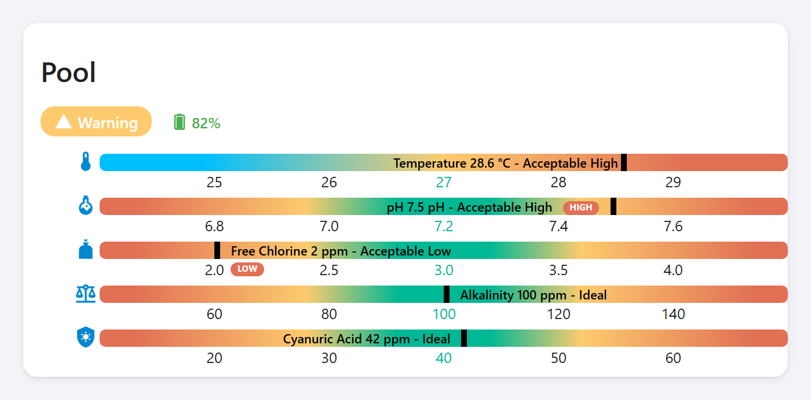
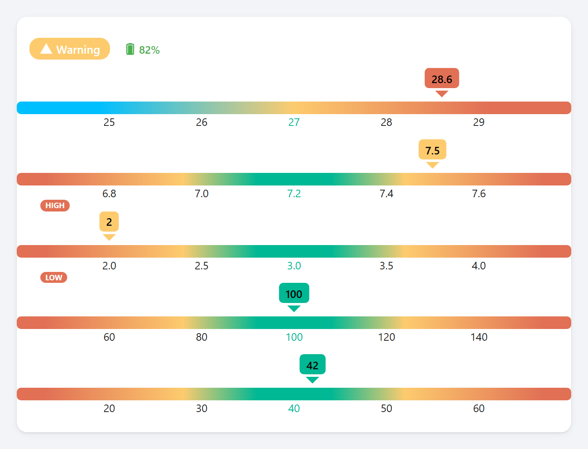
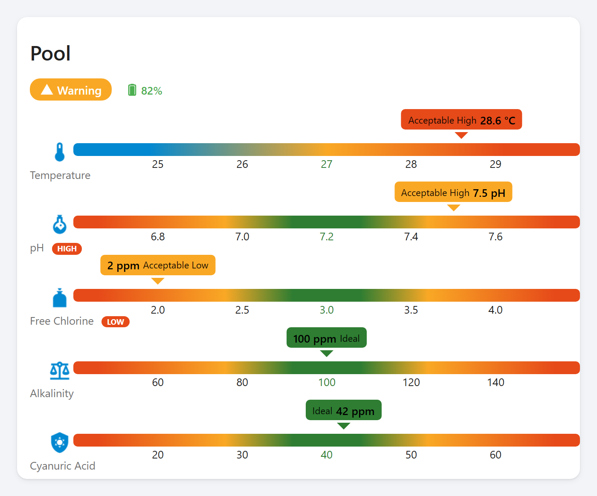
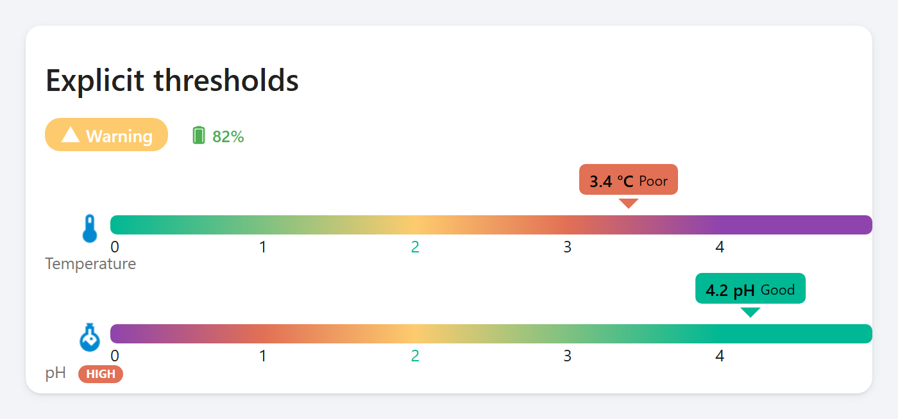
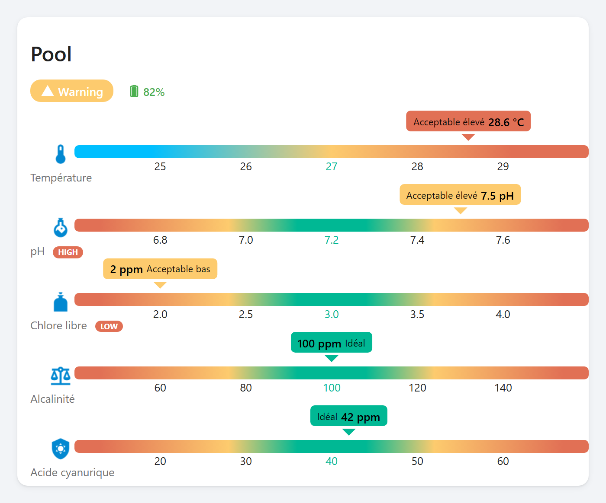
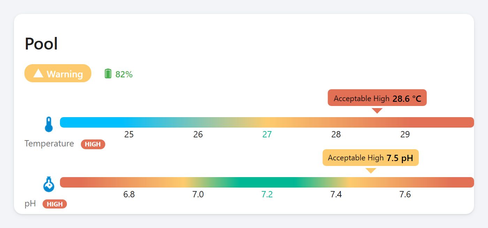
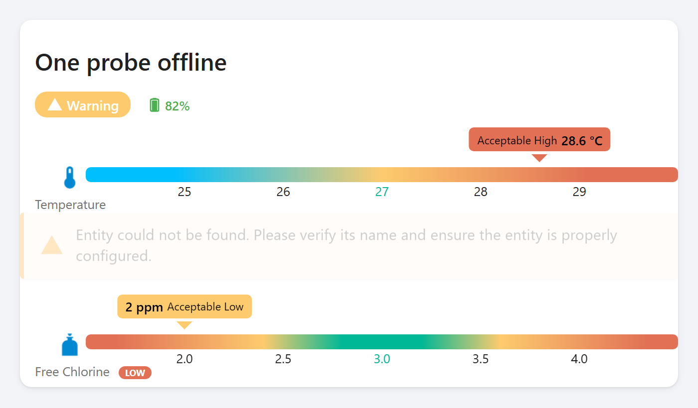

# Pool Monitor Card in detail

Eight ways to configure the same card. Each one is generated from the source
at the current version, so what is below is what this version does.

Back to the [README](../README.md).

## Default

Point it at your entities and stop there. Every preset carries its own unit, ideal value and thresholds.

## Compact

The name, the reading and the verdict move inside the bar. A row takes half the height, which is what makes a dozen measurements fit on a phone.

## Nothing but the bars

Names, labels, icons and units can each be turned off. Useful when the card sits under a heading that already says what it is.

## Your own colours

The six colours of the scale are yours to set, so the card can follow a theme instead of fighting it.

## Thresholds you set yourself

When the ideal sits at one end rather than in the middle, give the four boundaries and say which way the scale reads. The colours then run one way instead of meeting in the middle.

## Seventeen languages

Measurement names and verdicts follow the language you pick, or the one Home Assistant is already in. This one is French.

## Status and battery

A device that publishes its own verdict can show it, for the whole card or for one measurement, and a battery is read once for the device rather than repeated on every row.

## When a sensor stops answering

A reading that is missing, unavailable or not a number is drawn grey and left flat, rather than pretending to be zero.

